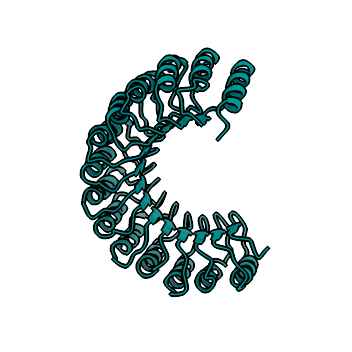

<h1>
  hopChopMF
</h1>

## Faster, Friendlier Protein Analysis in ChimeraX

3D protein structures are crucial for understanding biological function, yet experimental determination is often slow and complex. Computational tools such as AlphaFold now provide rapid predictions, but analyzing and comparing these models to experimental data can be challenging. UCSF ChimeraX offers powerful visualization and analysis features, but its complexity limits accessibility for new users and complicates workflows due to a complex syntax — even for advanced users. ChopChopMF addresses this issue by adding an intuitive graphical interface to ChimeraX. This interface enables both inexperienced and advanced users to quickly explore and analyze protein structures, with ChopChopMF tools covering topics such as: sequence alignments, AlphaMissense plots, Foldseek, PDBePisa plots, and more.

## Guide
Full Documentation, Installation Guide and Usage you can find here in the: 

## Installation 

After installing ChopChopMF, please close and restart ChimeraX. Installation Guide is within the: Installation Guide is within the [ChopChopMF Guide](https://lukasinscience.github.io/ChopChopMF/installation/)

## Latest Version

Version 1.1
