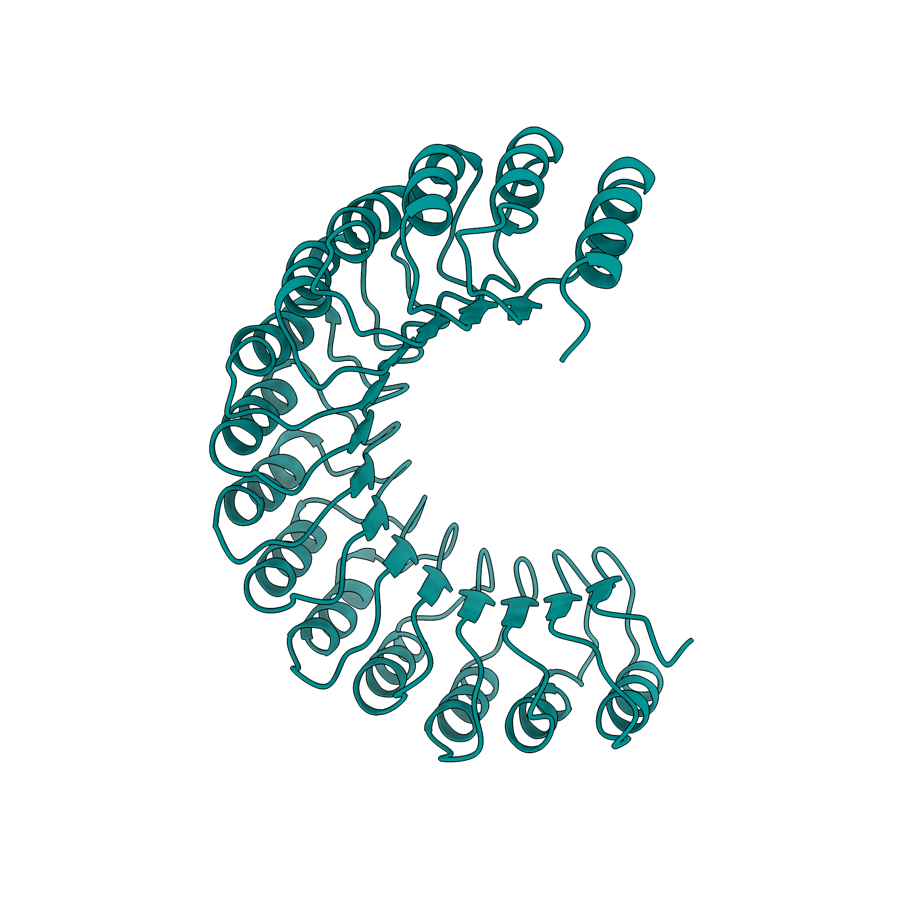

  
  <h1>hopChopMF</h1>

Welcome to the official guide for [**ChopChopMF**](https://cxtoolshed.rbvi.ucsf.edu/apps/chimeraxchopchopmf){ target="_blank" }, a specialized interface for fast and accessible protein structure analysis within [UCSF ChimeraX](https://www.cgl.ucsf.edu/chimerax/){ target="_blank" }.

## Overview
ChopChopMF streamlines the process of analyzing protein structures by providing an intuitive toolkit for researchers. Whether you are working with AlphaFold predictions, cryo-EM models, or experimental PDB structures, ChopChopMF helps you **chopchop** through the complexity of molecular data.

!!! question "Why did we develop ChopChopMF?"
    **Our mission is to democratize structural biology a bit more.**
     By eliminating the requirement for extensive command-line expertise, ChopChopMF empowers a diverse range of researchers to use the full potential of structural protein data. While providing an accessible entry point for newcomers to perform analysis—such as mapping sequence alignments, mutations, and protein-protein interfaces directly onto 3D structures— it also serves as a efficiency platform for advanced users. By automating routine workflows, experts can save valuable time and focus their efforts on more specific downstream research.

    Ultimately, **ChopChopMF** acts as a **bridge between disciplines**. It enables researchers from outside the structural biology field to better access, interpret, and share the structural protein data that structural biologists work so hard on to produce. Our goal is to create a more integrated research environment where structural insights are seamlessly shared and understood across all biological sciences.

### Key Features

* **Fast Analysis**: Optimized workflows to reduce the time looking up commands, all GUI based for easier and faster Workflows.
* **ChimeraX Native**: Fully integrated into the ChimeraX environment via the [Toolshed](https://cxtoolshed.rbvi.ucsf.edu/apps/chimeraxchopchopmf){ target="_blank" }.
* **Accessibility**: A simplified interface that makes advanced structural analysis tools available to a broader range of users.

## Getting Started

To get started with ChopChopMF, please follow these steps:

1.  **Installation**: Check the [Installation Guide](installation.md) to add the tool to your ChimeraX environment.
2.  **Basic Usage**: Visit the [Usage Page](usage.md) to see what Tools ChopChopMF offers you.
3.  **User-cases**: Here we need you! You found ChopChopMF usefull and you want to share for what and how it was useful? Or what we could improve? Please contact us via [E-mail](https://cxtoolshed.rbvi.ucsf.edu/apps/chimeraxchopchopmf){ target="_blank" } 

## Quick Links

* **Toolshed Page**: [ChopChopMF on UCSF Toolshed](https://cxtoolshed.rbvi.ucsf.edu/apps/chimeraxchopchopmf){ target="_blank" }
* **Paper**: Link to publication/Reference

* **Documentation**: [:simple-github: GitHub Repository](https://github.com/LUKASinScience/ChopChopMF){ .md-button .md-button--primary target="_blank"}

---
*ChopChopMF is a community-contributed tool for UCSF ChimeraX.*
