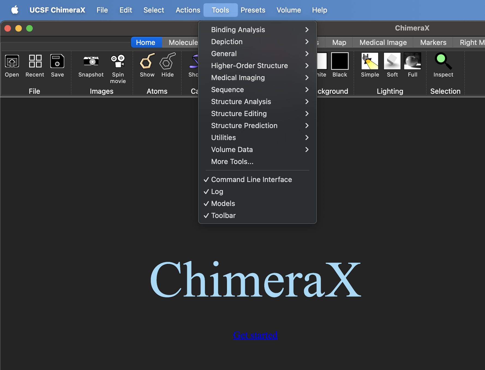

### Installation of ChopChopMF


#### Using the ChimeraX toolshed

1. Download the latest Version of ChimeraX (version ~=1.9) to your operating system from here: 
[ChimeraX Download](https://www.rbvi.ucsf.edu/chimerax/download.html#release){ target="_blank" }. 

You can install **ChopChopMF** by toolshed through the **GUI** within ChimeraX or by **command line**

**GUI**

2. Under `Tools` select `More Tools` a new window qwith the toolshed will open. Search for **ChopChopMF** and install the lates version.

!!! tip "Recomended Installation via Toolshed through CHimeraX"
    We recommend Installation through ChimeraX, you do not need any command, If ChopChopMF is not directly listed on the Toolshed start page, just search for ChopChopMF
    



**Command Line**

2. Run these commands in the ChimeraX shell:
```py
toolshed reload all
```
```py
toolshed install ChopChopMF
```

3. Relaunch ChimeraX

#### Using the wheel file

1. Download the latest Version of ChimeraX (version ~=1.9) to your operating system from here: 
[ChimeraX Download](https://www.rbvi.ucsf.edu/chimerax/download.html#release){ target="_blank" }. 

2. Download the latest ChopChopMF version [release](https://github.com/LUKASinScience/ChopChopMF/releases){ target="_blank" }.

3. Open ChimeraX and install the package using the command:
```py
toolshed install chimerax_chopchopmf-1.1-py3-none-any.whl
```

4. Relaunch ChimeraX