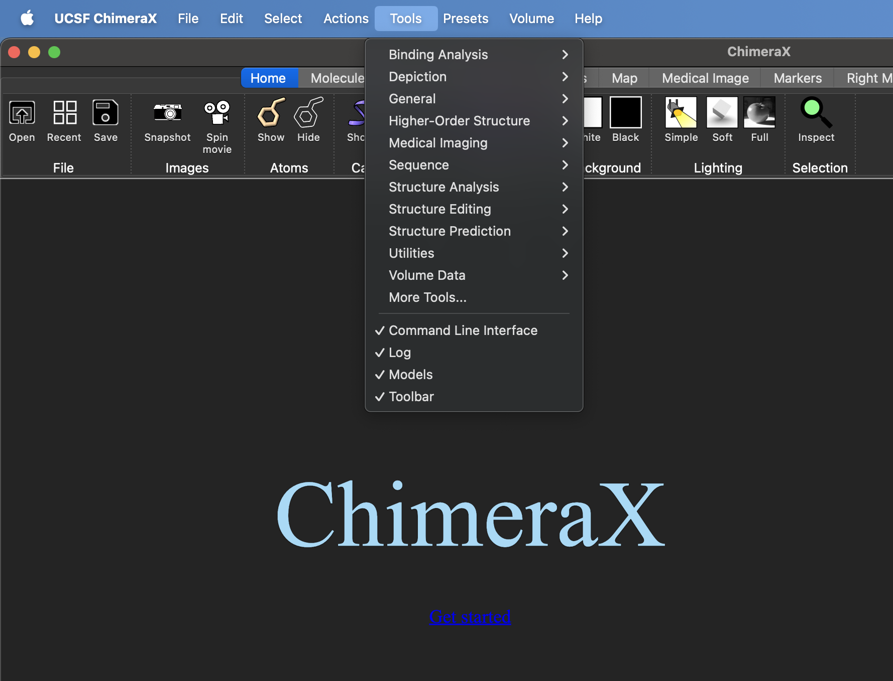

### :material-download-outline: Installation of ChopChopMF

1. Download the latest Version of ChimeraX (version ~=1.9) to your operating system from here:
[ChimeraX Download](https://www.rbvi.ucsf.edu/chimerax/download.html#release){ target="_blank" }.

Then pick one of the two installation methods below.

=== ":material-store-search-outline: Using the ChimeraX toolshed"

    You can install **ChopChopMF** by toolshed through the **GUI** within ChimeraX or by **command line**.

    !!! tip "Recommended Installation via Toolshed through ChimeraX"
        We recommend Installation through ChimeraX, you do not need any command, If ChopChopMF is not directly listed on the Toolshed start page, just search for ChopChopMF

    **GUI**

    1. Under `Tools` select `More Tools` a new window with the toolshed will open. Search for **ChopChopMF** and install the latest version.

    

    **Command Line**

    1. Run these commands in the ChimeraX shell:
    ```py
    toolshed reload all
    ```
    ```py
    toolshed install ChopChopMF
    ```

    2. Relaunch ChimeraX

=== ":material-package-variant-closed: Using the wheel file"

    1. Download the latest ChopChopMF version [release](https://github.com/LUKASinScience/ChopChopMF/releases){ target="_blank" }.

    2. Open ChimeraX and install the package using the command:
    ```py
    toolshed install chimerax_chopchopmf-1.4-py3-none-any.whl
    ```

    3. Relaunch ChimeraX