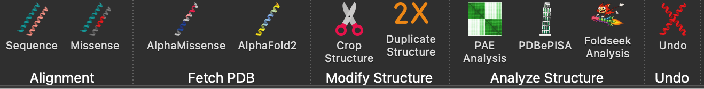
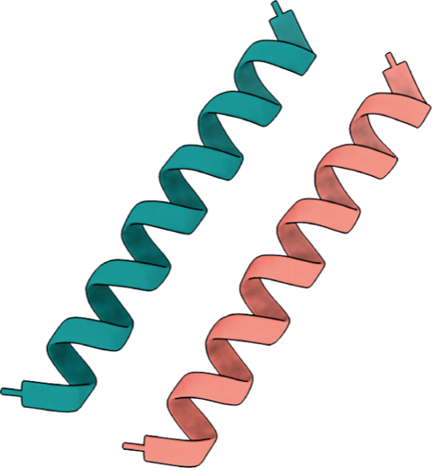
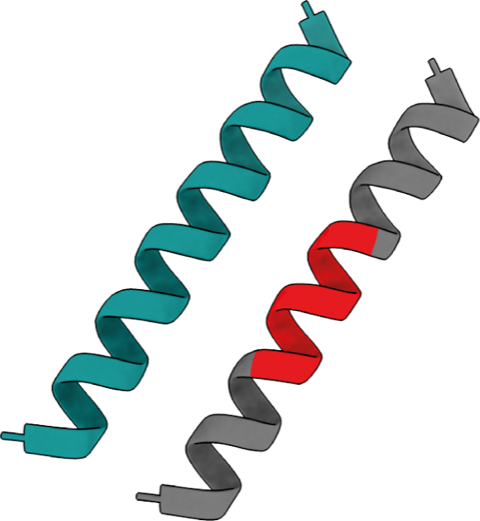
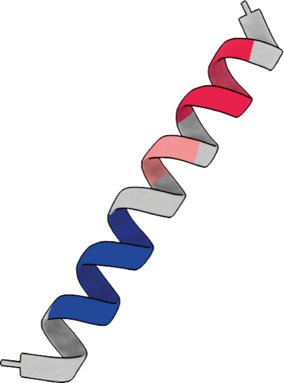
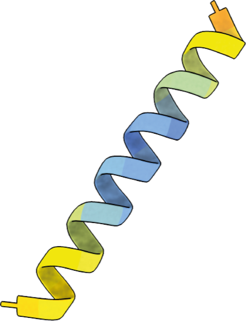
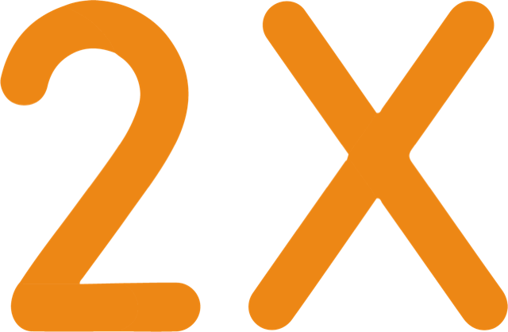
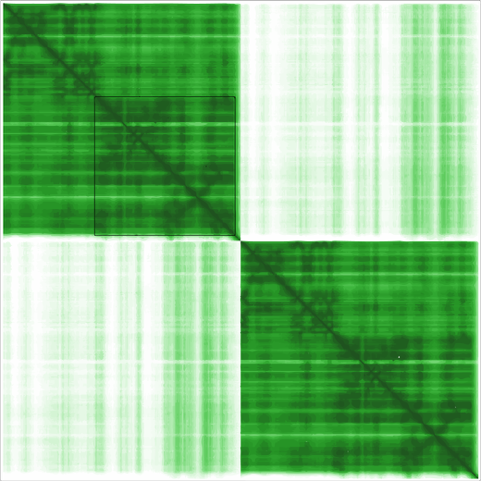
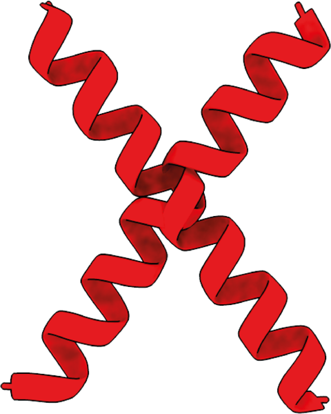

# Using ChopChopMF

ChopChopMF is a user-friendly GUI plug-in for ChimeraX designed to make protein structure analysis faster and more accessible.

!!! info "No Commands Needed"
    Every action in ChopChopMF triggers the underlying ChimeraX engine automatically, removing the need for complicated command-line syntax.

## The Toolbar

After [Installation of ChopChopMF](installation.md) and Restarting ChimeraX, you will find ChopChopMF and all it's tools in the Toolbar:

!!! tip "Know the File types used in ChimeraX"
    To get the most out of **ChopChopMF**, it is helpful to understand the different file types used by ChimeraX to represent molecular data. Therefore, there is a small section with  a quick overview of the most common formats you will encounter.

    If you are already familiar with ChimeraX, skip this and go directly to the fun part, the [**ChopChopMF Tools**](usage.md#chopchopmf-tools)

---

## ChimeraX

### ChimeraX Guide

!!! abstract "ChimeraX guides for general ChimeraX usage"
    ChimeraX allows you to make beautiful figures in may different styles. ChopChopMF can't cover all of those, if you are new to ChimeraX here are a some Guides, which can help you get started or might inspire you. 

    At the end you need to find your own style, supporting your science. Under the `Graphics` tab in ChimeraX you can also just try out, which style suits you best!

[:fontawesome-solid-user-graduate: UCSF ChimeraX User Guide](https://www.cgl.ucsf.edu/chimerax/docs/user/index.html){ .md-button .md-button--primary target="_blank"}

[:fontawesome-solid-user-graduate: ChimeraX Recipes](https://rbvi.github.io/chimerax-recipes/){ .md-button .md-button--primary target="_blank"}

### Structural Biology File Formats

[:material-file-check: File Types for ChimeraX](https://www.cgl.ucsf.edu/chimera/docs/UsersGuide/filetypes.html){ .md-button .md-button--primary target="_blank"}

---

**1. .pdb (Protein Data Bank)**

* **What it is:** The classic standard for 3D macromolecular structures.
* **Contents:** Atomic coordinates, residue names, chain IDs, and B-factors (representing atomic displacement/uncertainty).
* **Note:** PDB files have a strict column-based format and can struggle with very large structures like ribosomes.
* **Documentation:** [Introduction to PDB Format](https://www.cgl.ucsf.edu/chimerax/docs/user/formats/pdbintro.html){:target="_blank"}

**2. .cif / .mmCIF (Macromolecular Crystallographic Information File)**

* **What it is:** The modern, more flexible successor to the PDB format.
* **Contents:** Similar coordinate and chemical data as PDB, but stored in a table-based format that has no limit on the number of atoms or chains. This is now the default format for the Protein Data Bank.
* **Documentation:** [mmCIF Format ](https://mmcif.wwpdb.org/docs/faqs/pdbx-mmcif-faq-general.html){:target="_blank"}

**3. .mrc / .map (Density Map)**

* **What it is:** A "volume" file used primarily in Cryo-EM and Tomography.
* **Contents:** A 3D grid of voxels where each point has a value representing electron density. It does **not** contain atom names, but rather the "cloud" that atomic models are fitted into.
 

**4. .defattr (Attribute Assignment)**

* **What it is:** A simple text file used to "tag" atoms or residues with custom metadata.
* **Contents:** Numerical values mapped to specific residues (e.g., conservation scores, hydrophobicity, or AlphaMissense data). In ChimeraX, you can use these files to color your structure using the `color byattribute` command.
* **Documentation:** [Attribute Assignment (.defattr)](https://www.cgl.ucsf.edu/chimerax/docs/user/formats/defattr.html){:target="_blank"}

**5. .json (JavaScript Object Notation)**

* **What it is:** A general-purpose, human-readable data format used for metadata.
* **Contents:** In the context of structural predictions (like AlphaFold), `.json` files typically store the **Predicted Aligned Error (PAE)** maps or structural confidence scores.
* **Documentation:** [AlphaFold PAE/JSON Support](https://www.cgl.ucsf.edu/chimerax/docs/user/commands/alphafold.html){:target="_blank"}

---

## ChopChopMF Tools

### 1. Alignment
Tools to visualize mutations and conservation directly on the 3D structure.

For alignment MUSCLE multiple sequence alignment is used. 

The semi conservation of Amino acids is in ChopChopMF as in the following table stated:

??? info "Click to expand: Amino Acid Similarity Table"
    | Amino Acid (1-letter, 3-letter) | Similar Amino Acids (1-letter, 3-letter) |
    | :--- | :--- |
    | **V** (Val) | **I** (Ile) |
    | **L** (Leu) | **I** (Ile), **V** (Val) |
    | **I** (Ile) | **L** (Leu), **V** (Val) |
    | **F** (Phe) | **Y** (Tyr), **W** (Trp) |
    | **Y** (Tyr) | **F** (Phe), **W** (Trp) |
    | **W** (Trp) | **F** (Phe), **Y** (Tyr) |
    | **H** (His) | **N** (Asn), **Q** (Gln) |
    | **N** (Asn) | **H** (His), **Q** (Gln) |
    | **Q** (Gln) | **H** (His), **N** (Asn) |
    | **R** (Arg) | **K** (Lys) |
    | **K** (Lys) | **R** (Arg) |
    | **D** (Asp) | **E** (Glu) |
    | **E** (Glu) | **D** (Asp) |

{ align=left width="60" }
**Sequence** Performs a 1:1 sequence alignment using MUSCLE software to evaluate conservation levels.

??? tip "Conservation against a database? Try ConSurf"
    If you want to run a database against your protein, to see how the conservation is among a several proteins/isoforms/within a protein class, you should try and use ConSurf

    {:target="_blank"}

    *Click to open ConSurf webbrowser*

 

{ align=left width="60" }

**Missense** Performs a multiple sequence alignment of a non-human protein with a human sequence to plot AlphaMissense scores.

The following you should take into consideration, if you are using the **Missense** Tool

!!! info "AlphaMissense scores for Non-human Proteins"
    As mentioned in the **AlphaMissense** References tab below, trained model weights are not released for the AlphaMissense code.

    To anyways be able to "predict" in a way AlphaMissense scores for Non-human Proteins, the Missense tool allows you to perform a sequence alignment of the Non-human Protein with it's human Homolog.

    Only conserved residues will get the AlphaMissense score of the human protein.

!!! example "How to evaluate conserved AlphaMissense Scores?"
    When a non-human protein exhibits an extended region of conservation with its human ortholog, it suggests the presence of a conserved functional motif or domain. In such cases, AlphaMissense pathogenicity scores may theoretically be extrapolated to the non-human protein. 
        
    Conversely, conservation limited to isolated residues should be considered a significantly less robust basis for cross-species prediction 

 

### 2. Fetch PDB
Access structural databases through a simplified interface that skips complex fetch commands.

{ align=left width="60" }
**AlphaMissense** Fetches human protein structures with AlphaMissense scores by UniProt ID or uploaded TSV files.

=== "Analysis"

    * Enter Uniprot ID of Human Protein (for download path, your `Downloads` is the Default setting)

    Or

    * Select TSV file, containing the AlphaMissense Scoring information for upload and select the matching .pdb file

=== "References"

    !!! abstract "AlphaMissense Paper"

        [Accurate proteome-wide missense variant effect prediction with AlphaMissense](https://www.science.org/doi/10.1126/science.adg7492){:target="_blank"}

        The code is available under: [:simple-github: GitHub alphamissense](https://github.com/google-deepmind/alphamissense){ .md-button .md-button--primary target="_blank"}

        However, since trained model weights are not released, the code is not meant to be used for making new predictions!

    [:material-test-tube: Hegelab](https://alphamissense.hegelab.org/){ .md-button .md-button--primary target="_blank"}

AlphaMissense Structures and Scores are downloaded through the:

[:material-web: Hegelab AlphaMissense Hotspots](https://alphamissense.hegelab.org/hotspot){ .md-button .md-button--primary target="_blank"}

 

{ align=left width="60" }
**AlphaFold2** Accesses the AlphaFold database directly, plotting pLDDT scores and providing AlphaSync residue information. 
=== "AlphaFold"

    * **Fetch** Open the database structure with the most similar sequence. Switch `Sequence` to UniProt identifer, to use UniProt ID

    * **Search** Find similar sequences in the AlphaFold database using BLAST

    * **Predict** Compute a new structure using AlphaFold on Google servers.

=== "pLDDT Coloring"

    * Color by `B-Factor` your prediction with the pLDDT score

    * The AlphaFold Confidence Score Information is given for each color

=== "UniProt"

    !!! warning "**UniProt Annotation & Association**" 
    
        UniProt Annotation & Association can only be plotted by ChopChopMF if they are provided by UniProt!

    1. Select an opened Model, this must be from the AlphaFold Protein Structure Database or AlphaFold2

    2. If you selected a model from the AlphaFold Protein Structure Database ChopChopMF can enter already the UniProt ID, otherwise please enter.

=== "Databases"

    Links to [UniProt](https://www.uniprot.org/){ .md-button .md-button--primary target="_blank"} and [:simple-deepmind: AlphaFold Protein Structure Database](https://alphafold.ebi.ac.uk/){ .md-button .md-button--primary target="_blank"}

=== "AlphaSync"

    [    **AlphaSync** ](https://alphasync.stjude.org/){:target="_blank"}

    1. Select an opened Model, this must be from the AlphaFold Protein Structure Database or AlphaFold2

    Or

    1. Enter UniProt ID

    2. Run ***ChopChop AlphaSync Residue Data***

    3. By Clicking on `Residue Data` you get datatable. Under `Explanations` The Paramaters are explained
   

 

### 3. Modify Structure
Essential tools for preparing models for downstream analysis.

{ align=left width="60" }
**Crop Structure** Select a structure and residue range to keep; the tool automatically deletes all others.

=== "CropResidues"

    Set the Residues (Residue Range) you want to keep and remove alll others from the Chain.

    !!! tip "ChopChop Crop before Foldseek"
        Remove residues you are not interested before using Foldseek to focus on the parts you are interested in of your protein. Further removal of large disordered domains can help to improve Foldseek results in some cases

=== "Delete Chain"

    You want to get rid of a whole Chain? Just select and delet it.

    !!! warning "Deletions are terminal"
        If you delet Residues or Chains, you can't undo this. 

 

{ align=left width="60" }
**Duplicate Structure** Duplicates a model with one click to serve as a base for symmetric copies or measurements.

=== "Duplicate Structure"

    You want to duplicate your structure? Just select it and **ChopChop Double**

    The duplication works on a Chain level, if you wish to give the copy a slight offset to the original, tick `Apply offset to duplicate`. This way you can find it easier.

    !!! tip "ChopChop Double before ChopChop Crop"
    
        Modifications to the structure are terminal within ChimeraX, therefore you can first double your structure before you delete some residues.

=== "Measure Center"

    You have a Map and want to fit in several of your proteins in a symetric way into this Map? 

    Measure the Center of the Map! The center of the Map will be displaced in the Log.

=== "Symmetry Copies"

    You `ChopChop Measured Center` of your map?

    Copy from the log the XYZ coordinates and `Paste XYZ for center`. `Apply` or set the Center manually.

    Select the structure and your Symmetry.

    **ChopChop Symmetry Copies**

 

### 4. Analyze Structure
A platform for both inexperienced and advanced users to analyze complexes efficiently.

{ align=left width="60" }
**PAE Analysis** Rapidly investigates Predicted Aligned Error (PAE) values between selected chains.

=== "1. PAE Contacts"

    !!! warning "Only one Model can be opened in ChimeraX for evaluating the PAE Contacts!"
        Be aware that only one model/prediction of AlphaFold2 or AlphaFold3 can be opened. Besides the .pdb or .cif structure file you also need the matching .jason file from the prediction!

    Select the Chais you want to investigate, set the distance, recommended is not to go above 8Å (since protein-protein interactions above are too far away from each other)

    **ChopChop PAE**

=== "2. PAE Contact Residues"

    You saw some interesting or promising results with **ChopChop PAE** ? Now you would like to see the side chains of the pseudobonds with a good (blue) score?

    Just **ChopChop PAE interaction Residues** and have a closer look

    A much more preciser analysis of the PAE can be perfromed outside the ChimeraX environment with the [  **PAE Viewer** ](https://pae-viewer.uni-goettingen.de/){:target="_blank"}

 

{ align=left width="60" }
**PDBePISA** Directly plots interface residues, hydrogen bonds, and salt bridges calculated by the PISA webserver.

=== "Interface Scoring"

    !!! experiment  "How to get the XML file"

        To obtain the required data for the scoring module, follow these steps:

        1.  **Open PDBePISA:** [Click to open PDBePISA Website](https://www.ebi.ac.uk/pdbe/pisa/){:target="_blank"}
            * Press the `Launch PDBePisa` button.
            

        2.  **Submit Structure:** Enter your **PDB ID** or upload your `.pdb` file and click **Analyze**.
            *  Select `Coordinate file` to upload your structure of the protein complex
            
        3.  **Interface List:** Click the **Interfaces** button to see the list of identified macromolecular contacts.
        4.  **Detail View:** Press the **Details** button for the specific interface you want to analyze.
        5.  **Configure Display:** Scroll down to the **Interfacing residues** section.
        6.  **Export:** * Set the **Display level** to **Residues**.
            * Press the **XML** button.
            * Save the `.xml` file to your computer.

    

    **Using the ChopChopMF Interface**

    Once you have your XML file, use the **Interface Scoring** tab as follows:

    Scoring & Coloring Steps

    * **Load Data:** Click **Select PDBePISA XML File** and upload the file you just downloaded.

    * **Map Interfaces:** Click **ChopChop PISA Interfaces** to map the residues to your structure.

    * **Scoring Scheme:** The tool automatically categorizes residues based on:

        * ■ **Buried:** Residues hidden in the interface.
        * ■ **Hydrogen Bond:** Specific polar interactions.
        * ■ **Salt Bridge:** Electrostatic interactions between charged side chains.

    * **Update Visuals:** You can type new color names (e.g., `red`, `gold`, `blue`) in the text fields and click `Apply New Color Scheme`.

    ---

=== "ΔG Filter"

    !!! abstract "**PDBePISA: Solvation Energy (ΔG) Analysis**"

        The **ΔG Filter** tab in ChopChopMF allows you to visualize the thermodynamic contribution of specific residues to the interface stability, based on the `SOLVATIONENERGY` values provided in the PISA XML.

    **1. Setting up the Filter**

    Once your PDBePISA XML is loaded, you can fine-tune the visualization using these parameters:

    * **Load XML:** Use **Load PDBePISA XML File** to bring in your data.

    * **Append Mode:** Toggle this to accumulate residues across multiple loaded interfaces.

    * **Neutral band (+/- ε):** Define a baseline (default `0.01 kcal/mol`) for residues that contribute negligibly to the interface. These will be colored `lightgrey`.

    * **ΔG Cutoff:** Use the slider to filter out residues with low solvation energy. Checking **Only show residues ΔG cutoff** will hide everything below your specified threshold.

    ---

    **2. Using the ΔG Coloring Interface**

    This module maps energy values to a specific color palette to highlight "hotspots" in the interface:

   
    **Visualization Steps**

    1. **ChopChop ΔG Coloring:** Apply the energy-based colors to your structure in ChimeraX.

    2. **Plot ΔGValues:** Generate a graphical plot of the energy distribution across the interface residues.

    3. **Customizing the Palette:** You can modify the color assigned to each energy range. 

    ---

    !!! example "Understanding the Data"

        * **Source:** Values are read directly from the `SOLVATIONENERGY` field in the XML.

        * **Exclusions:** Residues with ΔG = 0.0 or a `BURIEDSURFACEAREA = 0` are automatically excluded to avoid noise from non-interfacing residues.

 

{ align=left width="60" }
**Foldseek Analysis** Provides a GUI for structural homolog searches within ChimeraX.

!!! tip "Use the Crop Structure Tool before Foldseek"

    Foldseek searches will be more precise and efficient if you crop away all unecessary residues within your structure, so the focus is on your **Domain of Interest**

    Disordered parts of the protein you might also want to delete, since IDPs have no fixed structure and are rather an ensamble of possible structures, Foldseek cant map those on a certain structure well.

Foldseek was great, but you are looking for more tools? There is more to explore, so far outside ChimeraX and ChopChopMF, but this should not hold you back!

[:fontawesome-solid-user-graduate: More Software by the Steinegger Lab](https://opendata.mmseqs.org/){ .md-button .md-button--primary target="_blank"}

[:fontawesome-solid-user-graduate: Foldseek Webserver](https://search.foldseek.com/search){ .md-button .md-button--primary target="_blank"}

 

### 5. Undo

{ align=left width="60" }
**Undo** Provides a safety function to revert an action besides structural modifications, which is not possible in ChimeraX.

 
