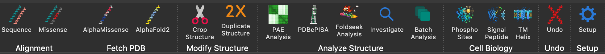
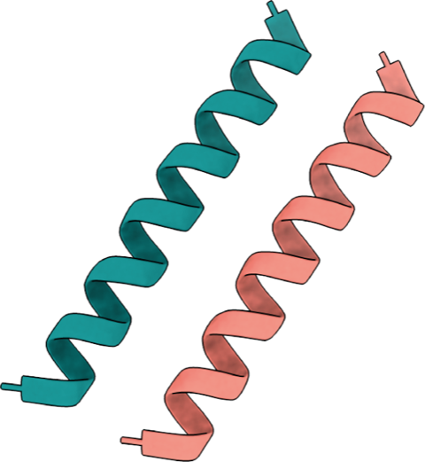
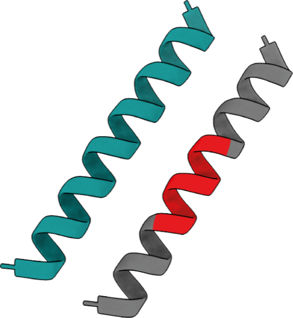
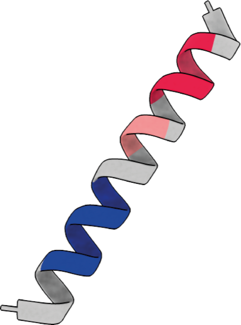
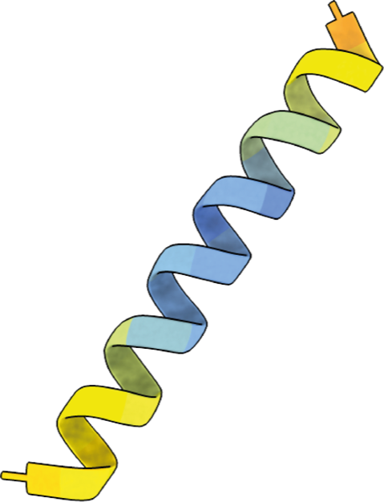
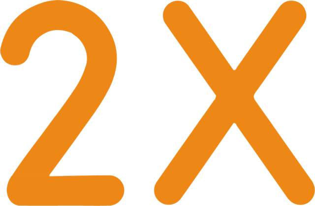
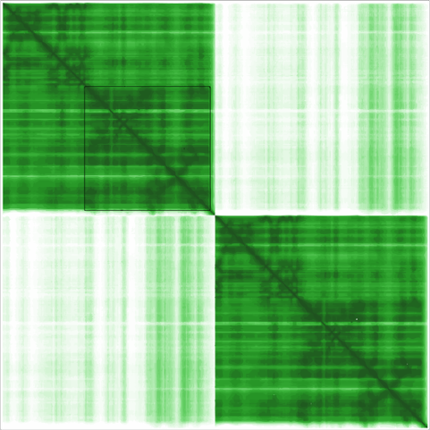
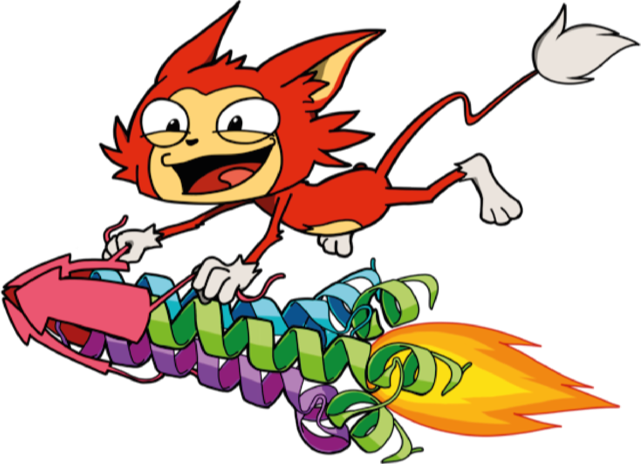
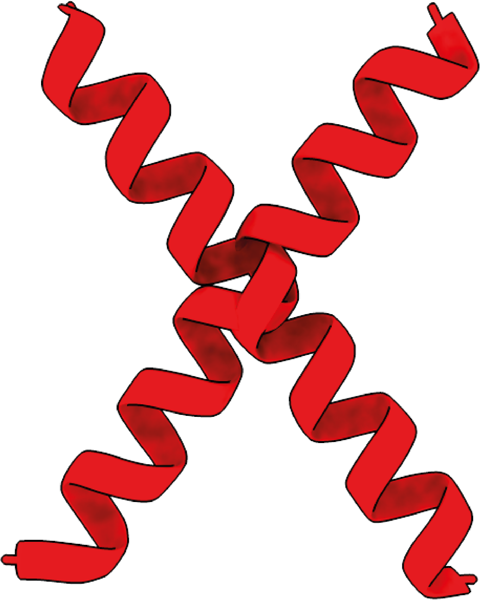

# Using ChopChopMF

ChopChopMF is a user-friendly GUI plug-in for ChimeraX designed to make protein structure analysis faster and more accessible.

!!! info "No Commands Needed"
    Every action in ChopChopMF triggers the underlying ChimeraX engine automatically, removing the need for complicated command-line syntax.

!!! tip "How to use this guide"
    Every tool in ChopChopMF has a **📖 Open Guide / Tutorial** button at the top of its window. Clicking it opens this page in your browser, jumped to the right tool's category, so you can keep the step-by-step instructions open next to ChimeraX while you work.

    Each tool below is explained the same way: a short **"What it does"**, then a **numbered walkthrough** with a concrete example, so you can follow along with your own structure. If you get stuck, look for the `???`/`!!!` boxes — they call out tips, warnings, and common pitfalls specific to that step.

## The Toolbar

After [Installation of ChopChopMF](installation.md) and Restarting ChimeraX, you will find ChopChopMF and all it's tools in the Toolbar:

!!! tip "Know the File types used in ChimeraX"
    To get the most out of **ChopChopMF**, it is helpful to understand the different file types used by ChimeraX to represent molecular data. Therefore, there is a small section with  a quick overview of the most common formats you will encounter.

    If you are already familiar with ChimeraX, skip this and go directly to the fun part, the [**ChopChopMF Tools**](usage.md#chopchopmf-tools)

---

## ChimeraX

### ChimeraX Guide

!!! abstract "ChimeraX guides for general ChimeraX usage"
    ChimeraX allows you to make beautiful figures in may different styles. ChopChopMF can't cover all of those, if you are new to ChimeraX here are a some Guides, which can help you get started or might inspire you. 

    At the end you need to find your own style, supporting your science. Under the `Graphics` tab in ChimeraX you can also just try out, which style suits you best!

[:fontawesome-solid-user-graduate: UCSF ChimeraX User Guide](https://www.cgl.ucsf.edu/chimerax/docs/user/index.html){ .md-button .md-button--primary target="_blank"}

[:fontawesome-solid-user-graduate: ChimeraX Recipes](https://rbvi.github.io/chimerax-recipes/){ .md-button .md-button--primary target="_blank"}

### Structural Biology File Formats

[:material-file-check: File Types for ChimeraX](https://www.cgl.ucsf.edu/chimera/docs/UsersGuide/filetypes.html){ .md-button .md-button--primary target="_blank"}

---

**1. .pdb (Protein Data Bank)**

* **What it is:** The classic standard for 3D macromolecular structures.
* **Contents:** Atomic coordinates, residue names, chain IDs, and B-factors (representing atomic displacement/uncertainty).
* **Note:** PDB files have a strict column-based format and can struggle with very large structures like ribosomes.
* **Documentation:** [Introduction to PDB Format](https://www.cgl.ucsf.edu/chimerax/docs/user/formats/pdbintro.html){:target="_blank"}

**2. .cif / .mmCIF (Macromolecular Crystallographic Information File)**

* **What it is:** The modern, more flexible successor to the PDB format.
* **Contents:** Similar coordinate and chemical data as PDB, but stored in a table-based format that has no limit on the number of atoms or chains. This is now the default format for the Protein Data Bank.
* **Documentation:** [mmCIF Format ](https://mmcif.wwpdb.org/docs/faqs/pdbx-mmcif-faq-general.html){:target="_blank"}

**3. .mrc / .map (Density Map)**

* **What it is:** A "volume" file used primarily in Cryo-EM and Tomography.
* **Contents:** A 3D grid of voxels where each point has a value representing electron density. It does **not** contain atom names, but rather the "cloud" that atomic models are fitted into.
 

**4. .defattr (Attribute Assignment)**

* **What it is:** A simple text file used to "tag" atoms or residues with custom metadata.
* **Contents:** Numerical values mapped to specific residues (e.g., conservation scores, hydrophobicity, or AlphaMissense data). In ChimeraX, you can use these files to color your structure using the `color byattribute` command.
* **Documentation:** [Attribute Assignment (.defattr)](https://www.cgl.ucsf.edu/chimerax/docs/user/formats/defattr.html){:target="_blank"}

**5. .json (JavaScript Object Notation)**

* **What it is:** A general-purpose, human-readable data format used for metadata.
* **Contents:** In the context of structural predictions (like AlphaFold), `.json` files typically store the **Predicted Aligned Error (PAE)** maps or structural confidence scores.
* **Documentation:** [AlphaFold PAE/JSON Support](https://www.cgl.ucsf.edu/chimerax/docs/user/commands/alphafold.html){:target="_blank"}

---

## ChopChopMF Tools

### 1. Alignment
Tools to visualize mutations and conservation directly on the 3D structure.

For alignment MUSCLE multiple sequence alignment is used. 

The semi conservation of Amino acids is in ChopChopMF as in the following table stated:

??? info "Click to expand: Amino Acid Similarity Table"
    | Amino Acid (1-letter, 3-letter) | Similar Amino Acids (1-letter, 3-letter) |
    | :--- | :--- |
    | **V** (Val) | **I** (Ile) |
    | **L** (Leu) | **I** (Ile), **V** (Val) |
    | **I** (Ile) | **L** (Leu), **V** (Val) |
    | **F** (Phe) | **Y** (Tyr), **W** (Trp) |
    | **Y** (Tyr) | **F** (Phe), **W** (Trp) |
    | **W** (Trp) | **F** (Phe), **Y** (Tyr) |
    | **H** (His) | **N** (Asn), **Q** (Gln) |
    | **N** (Asn) | **H** (His), **Q** (Gln) |
    | **Q** (Gln) | **H** (His), **N** (Asn) |
    | **R** (Arg) | **K** (Lys) |
    | **K** (Lys) | **R** (Arg) |
    | **D** (Asp) | **E** (Glu) |
    | **E** (Glu) | **D** (Asp) |

{ align=left width="60" }
**Sequence** Performs a 1:1 sequence alignment using MUSCLE software to evaluate conservation levels.

**How to use it:**

1. Open a structure in ChimeraX (any `.pdb`/`.cif` you have loaded).
2. In the **Sequence** tool, pick the model and chain you want to align from the dropdown, e.g. `Model 1, Chain A`. Click **↻ Refresh model list** if you opened the structure after starting the tool.
3. In the text field, enter either:
    * a raw amino acid sequence (e.g. `MVLSPADKTNVKAAWGKVGAHAGEYGAEALERMFLSFPTTKTYFPHF...`), or
    * a UniProt ID (e.g. `P69905`, human hemoglobin subunit alpha) — ChopChopMF detects the digits and fetches the FASTA sequence for you automatically.
4. Click **ChopChop SequenceAlignment**. The structure is colored by conservation using the scoring scheme shown below the button.
5. (Optional) Set a download folder — it's remembered for next time — and click **Download** to save the alignment CSV/defattr files there.
6. (Optional) Type new color names (e.g. `red`, `gold`) into the four fields and click **Apply New Color Scheme** to recolor without redoing the alignment.

??? tip "Conservation against a database? Try ConSurf"
    If you want to run a database against your protein, to see how the conservation is among a several proteins/isoforms/within a protein class, you should try and use ConSurf

    {:target="_blank"}

    *Click to open ConSurf webbrowser*

 

{ align=left width="60" }

**Missense** Performs a multiple sequence alignment of a non-human protein with a human sequence to plot AlphaMissense scores.

**How to use it:**

1. Open the non-human structure you want to score (e.g. a mouse or zebrafish ortholog) in ChimeraX.
2. In the **Missense** tool, select the model/chain of the non-human protein, e.g. `1:A`.
3. Enter the **human** ortholog's UniProt ID, e.g. `P04637` (human TP53) if your structure is a Trp53 ortholog.
4. Click **ChopChop Missense Alignment**. ChopChopMF aligns both sequences, then colors only the residues that match the human sequence exactly with the corresponding AlphaMissense score; everything else is colored yellow ("no score").

The following you should take into consideration, if you are using the **Missense** Tool

!!! info "AlphaMissense scores for Non-human Proteins"
    As mentioned in the **AlphaMissense** References tab below, trained model weights are not released for the AlphaMissense code.

    To anyways be able to "predict" in a way AlphaMissense scores for Non-human Proteins, the Missense tool allows you to perform a sequence alignment of the Non-human Protein with it's human Homolog.

    Only conserved residues will get the AlphaMissense score of the human protein.

!!! example "How to evaluate conserved AlphaMissense Scores?"
    When a non-human protein exhibits an extended region of conservation with its human ortholog, it suggests the presence of a conserved functional motif or domain. In such cases, AlphaMissense pathogenicity scores may theoretically be extrapolated to the non-human protein. 
        
    Conversely, conservation limited to isolated residues should be considered a significantly less robust basis for cross-species prediction 

 

### 2. Fetch PDB
Access structural databases through a simplified interface that skips complex fetch commands.

{ align=left width="60" }
**AlphaMissense** Fetches human protein structures with AlphaMissense scores by UniProt ID or uploaded TSV files.

=== "Analysis"

    **How to use it:**

    1. Enter the UniProt ID of a **human** protein, e.g. `P38398` (BRCA1).
    2. Check/adjust the download folder — it defaults to `Downloads` and is remembered between ChimeraX sessions.
    3. Click **ChopChop Missense PDB**. ChopChopMF downloads the matching structure and AlphaMissense scores, opens the structure in ChimeraX, and colors it by the scoring scheme shown below.

    **Already have your own TSV?**

    1. Tick **Use uploaded AlphaMissense TSV file**.
    2. Click **Browse** and select your `.tsv` file.
    3. Select the open ChimeraX model to use for chain-length detection (click **↻ Refresh model list** if it's not listed yet).
    4. Click **ChopChop Missense PDB** as above.

=== "References"

    !!! abstract "AlphaMissense Paper"

        [Accurate proteome-wide missense variant effect prediction with AlphaMissense](https://www.science.org/doi/10.1126/science.adg7492){:target="_blank"}

        The code is available under: [:simple-github: GitHub alphamissense](https://github.com/google-deepmind/alphamissense){ .md-button .md-button--primary target="_blank"}

        However, since trained model weights are not released, the code is not meant to be used for making new predictions!

    [:material-test-tube: Hegelab](https://alphamissense.hegelab.org/){ .md-button .md-button--primary target="_blank"}

AlphaMissense Structures and Scores are downloaded through the:

[:material-web: Hegelab AlphaMissense Hotspots](https://alphamissense.hegelab.org/hotspot){ .md-button .md-button--primary target="_blank"}

 

{ align=left width="60" }
**AlphaFold2** Accesses the AlphaFold database directly, plotting pLDDT scores and providing AlphaSync residue information.

!!! info "Two windows open at once — that's expected"
    Clicking the **AlphaFold2** toolbar button opens **two** things: ChimeraX's own built-in **AlphaFold** tool (for fetching/searching/predicting structures) *and* ChopChopMF's **AlphaFold Info** panel described below, which adds pLDDT coloring, UniProt association, and AlphaSync data on top. You'll typically use both together — fetch or open a structure in the first, then color/annotate it in the second.

=== "AlphaFold (built into ChimeraX)"

    * **Fetch** Open the database structure with the most similar sequence. Switch `Sequence` to UniProt identifer, to use UniProt ID

    * **Search** Find similar sequences in the AlphaFold database using BLAST

    * **Predict** Compute a new structure using AlphaFold on Google servers.

=== "pLDDT Coloring"

    **How to use it:**

    1. Open or fetch an AlphaFold structure (via the tab above, or any model with B-factor = pLDDT).
    2. Select it in the **Select model to color** dropdown, e.g. `#1 AF-P04637-F1`.
    3. Click **Color selected model by AlphaFold2 pLDDT score**. The structure is colored per-residue using the confidence scale shown above the button (dark orange = very low, blue = very high).

=== "UniProt"

    !!! warning "**UniProt Annotation & Association**" 
    
        UniProt Annotation & Association can only be plotted by ChopChopMF if they are provided by UniProt!

    **How to use it:**

    1. Select the AlphaFold structure from the list, e.g. `#1 AF-P04637-F1`, and click **Use Selected Model** — ChopChopMF fills in the UniProt ID and chain for you.
    2. If your model wasn't fetched from the AlphaFold database, type the UniProt ID yourself (e.g. `P04637`) and pick the chain manually.
    3. Click **4. Fetch UniProt Annotation & Associate** to pull the UniProt annotation and link it to that chain.

=== "Databases"

    Links to [UniProt](https://www.uniprot.org/){ .md-button .md-button--primary target="_blank"} and [:simple-deepmind: AlphaFold Protein Structure Database](https://alphafold.ebi.ac.uk/){ .md-button .md-button--primary target="_blank"}

=== "AlphaSync"

    [    **AlphaSync** ](https://alphasync.stjude.org/){:target="_blank"}

    **How to use it:**

    1. Go to the **Structure Selection** sub-tab, select an open AlphaFold structure (e.g. `#1 AF-P04637-F1`) and click **Use Selected Model** — or just type a UniProt ID (e.g. `P04637`) directly into the field above.
    2. Click **ChopChop AlphaSync Residue Data**.
    3. Open the **Residue Data** sub-tab to see the per-residue table (pLDDT, SASA, RSA, surface/core, disorder, secondary structure, contacts).
    4. Not sure what a column means? Check the **Explanation** sub-tab — click any parameter name to expand its definition.

 

### 3. Modify Structure
Essential tools for preparing models for downstream analysis.

{ align=left width="60" }
**Crop Structure** Select a structure and residue range to keep; the tool automatically deletes all others.

=== "Crop Residues"

    **How to use it:**

    1. Select the **model** and **chain** you want to crop, e.g. `Model 1`, chain `A`. Click **↻ Refresh model list and chains** if it's not listed.
    2. In **Residue range to keep**, enter the residues you want to *keep* — everything else is removed. Example: `1-120,150-200` keeps residues 1 through 120 and 150 through 200, and deletes everything in between and after.
    3. (Optional but recommended) Click **Hide Deletion Preview** first — this hides the residues that *would* be removed without deleting anything, so you can check the range is right. Click it again ("Reset Preview") to undo the preview.
    4. Click **ChopChop Crop** to actually delete the residues outside your range.

    !!! tip "ChopChop Crop before Foldseek"
        Remove residues you are not interested before using Foldseek to focus on the parts you are interested in of your protein. Further removal of large disordered domains can help to improve Foldseek results in some cases

=== "Delete Chain"

    **How to use it:**

    1. Select the **model** and **chain** you want to remove entirely, e.g. `Model 1`, chain `B`.
    2. Click **Delete Chain**.

    !!! warning "Deletions are terminal"
        If you delete residues or chains, you can't undo this. 

 

{ align=left width="60" }
**Duplicate Structure** Duplicates a model with one click to serve as a base for symmetric copies or measurements.

=== "Duplicate Structure"

    **How to use it:**

    1. Select the **model** to duplicate, e.g. `Model 1`.
    2. Select a **chain**, or leave it on `*(All chains)` to duplicate the whole model.
    3. (Optional) Tick **Apply offset to duplicate** and set ΔX/ΔY/ΔZ, e.g. `50` Å in ΔX, to place the copy visibly next to the original instead of directly on top of it.
    4. Click **ChopChop Double**.

    !!! tip "ChopChop Double before ChopChop Crop"
    
        Modifications to the structure are terminal within ChimeraX, therefore you can first double your structure before you delete some residues.

=== "Measure Center"

    **How to use it:**

    1. Select the **map/volume** you want to center on, e.g. `#2 (my_map.mrc)`. Click **↻ Refresh maps** if it isn't listed yet.
    2. Click **ChopChop Measure Center**. The XYZ center coordinates are printed to the ChimeraX **Log** — keep the Log window open so you can copy them in the next step.

=== "Symmetry Copies"

    **How to use it:**

    1. Ran **Measure Center** above? Copy the XYZ coordinates from the Log, paste them into **Paste XYZ for center** (e.g. `353.79, 353.79, 333.95`) and click **Apply**. Otherwise, type the Center X/Y/Z values manually.
    2. Select the **structure model** to copy, e.g. `Model 1`.
    3. Select the **symmetry group**, e.g. `C2` for a 2-fold symmetric assembly, or `D3` for a dihedral trimer-of-dimers.
    4. Click **ChopChop Symmetry Copies**.

 

### 4. Analyze Structure
A platform for both inexperienced and advanced users to analyze complexes efficiently.

{ align=left width="60" }
**PAE Analysis** Rapidly investigates Predicted Aligned Error (PAE) values between selected chains.

=== "1. PAE Contacts"

    !!! warning "Only one Model can be opened in ChimeraX for evaluating the PAE Contacts!"
        Be aware that only one model/prediction of AlphaFold2 or AlphaFold3 can be opened. Besides the .pdb or .cif structure file you also need the matching .json file from the prediction!

    **How to use it:**

    1. Open your predicted complex (e.g. an AlphaFold-Multimer `.cif`) — it must be the *only* open model.
    2. Click **Load .json file** and select the matching PAE `.json` from the same prediction. This opens ChimeraX's own **AlphaFold Error Plot** tool.
    3. Click **↻ Refresh model list**, then select the two chains you want to check for contacts, e.g. chain `A` and chain `B`.
    4. Set the **distance** cutoff — `5` Å is a good starting point; avoid going above `8` Å, since protein-protein interactions further apart than that are unlikely to be real contacts.
    5. Click **ChopChop PAE**. ChopChopMF draws pseudobonds between residue pairs whose predicted error is below the cutoff.

=== "2. PAE Contact Residues"

    You saw some interesting or promising results with **ChopChop PAE**? Now you would like to see the side chains of the pseudobonds with a good (blue) score?

    **How to use it:**

    1. Run **ChopChop PAE** in the first tab first, so a "PAE Contacts" pseudobond model exists.
    2. Click **ChopChop PAE interaction Residues**. The contact residues are selected, shown as sticks, and colored by chain/heteroatom for a closer look.

    A much more precise analysis of the PAE can be performed outside the ChimeraX environment with the [  **PAE Viewer** ](https://pae-viewer.uni-goettingen.de/){:target="_blank"}

 

{ align=left width="60" }
**PDBePISA** Directly plots interface residues, hydrogen bonds, and salt bridges calculated by the PISA webserver.

=== "Interface Scoring"

    !!! experiment  "How to get the XML file"

        To obtain the required data for the scoring module, follow these steps:

        1.  **Open PDBePISA:** [Click to open PDBePISA Website](https://www.ebi.ac.uk/pdbe/pisa/){:target="_blank"}
            * Press the `Launch PDBePisa` button.
            

        2.  **Submit Structure:** Enter your **PDB ID** or upload your `.pdb` file and click **Analyze**.
            *  Select `Coordinate file` to upload your structure of the protein complex
            
        3.  **Interface List:** Click the **Interfaces** button to see the list of identified macromolecular contacts.
        4.  **Detail View:** Press the **Details** button for the specific interface you want to analyze.
        5.  **Configure Display:** Scroll down to the **Interfacing residues** section.
        6.  **Export:** * Set the **Display level** to **Residues**.
            * Press the **XML** button.
            * Save the `.xml` file to your computer.

    

    **Using the ChopChopMF Interface**

    Once you have your XML file, use the **Interface Scoring** tab as follows:

    1. **Select the target model:** pick the model the XML residues belong to, e.g. `Model 1`. Click **↻ Refresh model list** if it isn't listed.
    2. **Load Data:** Click **Select PDBePISA XML File** and upload the file you just downloaded.
    3. **Map Interfaces:** Loading the file already selects and colors the interface residues in darkorange. To (re-)apply the full 3-way scoring, click **ChopChop PISA Interfaces** and select the `_output.defattr` file that was written next to your XML.
    4. **Scoring Scheme:** The tool automatically categorizes residues based on:

        * ■ **Buried:** Residues hidden in the interface.
        * ■ **Hydrogen Bond:** Specific polar interactions.
        * ■ **Salt Bridge:** Electrostatic interactions between charged side chains.

    5. **Update Visuals (optional):** Type new color names (e.g., `red`, `gold`, `blue`) in the text fields and click **Apply New Color Scheme**.

    ---

=== "ΔG Filter"

    !!! abstract "**PDBePISA: Solvation Energy (ΔG) Analysis**"

        The **ΔG Filter** tab in ChopChopMF allows you to visualize the thermodynamic contribution of specific residues to the interface stability, based on the `SOLVATIONENERGY` values provided in the PISA XML.

    **1. Setting up the Filter**

    1. **Select the target model:** pick the model the XML residues belong to, e.g. `Model 1`.
    2. **Load XML:** Click **Load PDBePISA XML File** to bring in your data. You can load more than one XML (e.g. for several interfaces of the same complex) and switch between them with the **Active XML file** dropdown.
    3. **Append Mode (optional):** Toggle this to accumulate residues across *all* loaded XMLs at once instead of just the active one.
    4. **Neutral band (optional):** Leave **Neutral band (±ε)** checked to keep near-zero residues (default `ε = 0.01 kcal/mol`) colored `lightgrey` as a baseline, so only meaningfully stabilizing/destabilizing residues stand out.
    5. **ΔG Cutoff:** Use the slider to set a threshold, e.g. `0.50 kcal/mol`. With **Only show residues ≥ cutoff** checked, residues below that are excluded from coloring.

    ---

    **2. Using the ΔG Coloring Interface**

    This module maps energy values to a specific color palette to highlight "hotspots" in the interface:

    1. Click **ChopChop ΔG Coloring** to apply the energy-based colors to your structure in ChimeraX.
    2. Click **Plot ΔG Values** to open a bar chart, scatter plot, and value list of every colored residue — handy for picking a good cutoff.
    3. (Optional) Adjust the color fields under **ΔG Palette** and click **Apply New Color Scheme** to recolor with your own palette; the plot follows the same colors.

    ---

    !!! example "Understanding the Data"

        * **Source:** Values are read directly from the `SOLVATIONENERGY` field in the XML.

        * **Exclusions:** Residues with ΔG = 0.0 or a `BURIEDSURFACEAREA = 0` are automatically excluded to avoid noise from non-interfacing residues.

 

{ align=left width="60" }
**Foldseek Analysis** Provides a GUI for structural homolog searches within ChimeraX.

**How to use it:**

1. Select the **target database**: `PDB (default)` to search experimental structures, or `AlphaFold DB (afdb50)` to search predicted structures.
2. Select the **model** and **chain** to search with, e.g. `1:A`. Click **↻ Refresh model list** if needed.
3. Click **ChopChop Foldseek**. ChimeraX runs the structural search and reports the closest structural homologs.

!!! tip "Use the Crop Structure Tool before Foldseek"

    Foldseek searches will be more precise and efficient if you crop away all unecessary residues within your structure, so the focus is on your **Domain of Interest**

    Disordered parts of the protein you might also want to delete, since IDPs have no fixed structure and are rather an ensamble of possible structures, Foldseek cant map those on a certain structure well.

Foldseek was great, but you are looking for more tools? There is more to explore, so far outside ChimeraX and ChopChopMF, but this should not hold you back!

[:fontawesome-solid-user-graduate: More Software by the Steinegger Lab](https://opendata.mmseqs.org/){ .md-button .md-button--primary target="_blank"}

[:fontawesome-solid-user-graduate: Foldseek Webserver](https://search.foldseek.com/search){ .md-button .md-button--primary target="_blank"}

 

### 5. Undo

{ align=left width="60" }
**Undo** A one-click shortcut for ChimeraX's own `undo` command, right in the ChopChopMF toolbar.

**How to use it:** Click **Undo** to revert your last action.

!!! warning "Not everything can be undone"
    ChimeraX's undo covers most commands, but **not** destructive structural edits made through ChopChopMF's **Crop Structure** or **Duplicate Structure → Delete Chain** tools — those deletions are terminal (see the warnings in [Modify Structure](#3-modify-structure) above).

 
