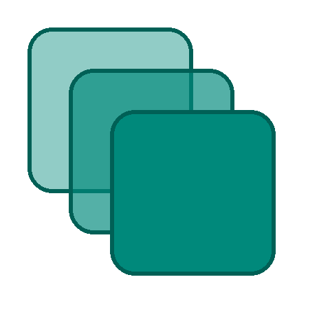
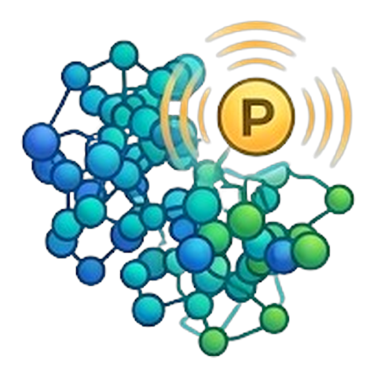
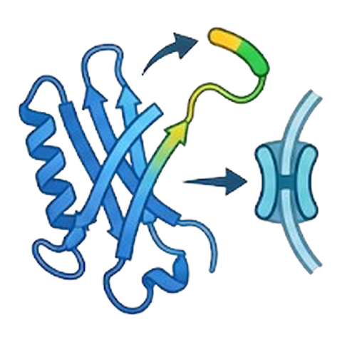
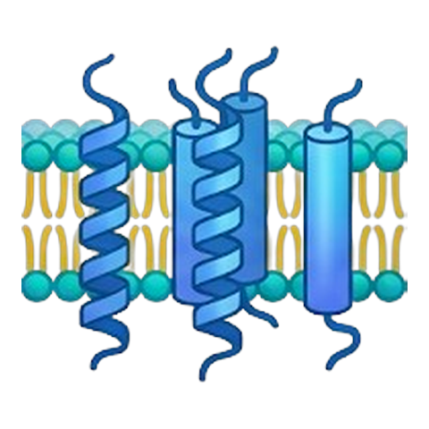

# Using ChopChopMF

ChopChopMF is a user-friendly GUI plug-in for ChimeraX designed to make protein structure analysis faster and more accessible.

!!! info "No Commands Needed"
    Every action in ChopChopMF triggers the underlying ChimeraX engine automatically, removing the need for complicated command-line syntax.

!!! tip "How to use this guide"
    Every tool in ChopChopMF has an **:material-book-open-page-variant: Open Guide / Tutorial** button at the top of its window. Clicking it opens this page in your browser, jumped to the right tool's category, so you can keep the step-by-step instructions open next to ChimeraX while you work.

    Each tool below is explained the same way: a short **"What it does"**, then a **numbered walkthrough** with a concrete example, so you can follow along with your own structure. If you get stuck, look for :material-lightbulb-on-outline: tip and :material-alert-outline: warning boxes throughout — they call out common pitfalls specific to that step — and click any :material-chevron-down-box-outline: **Example** box to expand a worked-through scenario.

!!! abstract "Want the deeper background?"
    This guide covers *how to use ChopChopMF*. For the underlying concepts - what PAE, pLDDT, and ipTM actually mean, how AlphaFold works, how to read AlphaMissense scores - see Lukas's companion [**AlphaFold Guide**](https://lukasinscience.github.io/AlphaFold-Guide/){:target="_blank"}, which also has its own [ChopChopMF workflows section](https://lukasinscience.github.io/AlphaFold-Guide/chopchopmf/workflows/){:target="_blank"} with more end-to-end recipes.

## :material-view-grid-outline: The Toolbar

After [Installation of ChopChopMF](installation.md) and Restarting ChimeraX, you will find ChopChopMF and all it's tools in the Toolbar:

!!! tip "Know the File types used in ChimeraX"
    To get the most out of **ChopChopMF**, it is helpful to understand the different file types used by ChimeraX to represent molecular data. Therefore, there is a small section with  a quick overview of the most common formats you will encounter.

    If you are already familiar with ChimeraX, skip this and go directly to the fun part, the [**ChopChopMF Tools**](usage.md#chopchopmf-tools)

---

## :material-folder-outline: Input & Output Files

Where things are read from and saved to, across every tool - handy to know once, rather than rediscovering it tool by tool.

**Loading input:**

- **Structures** (`.pdb`/`.cif`) - open from anywhere, ChimeraX/ChopChopMF doesn't care where.
- **PAE `.json` files** - expected in the same folder as the structure they belong to (the normal convention for AlphaFold3-server, AlphaFold DB, and ColabFold output). PAE Analysis's **Load .json file** dialog opens directly in the structure's own folder by default. Batch Analysis's **Folder of files** mode goes a step further for AlphaFold3-server naming specifically (`..._model_N.cif` next to `..._full_data_N.json`) and loads the matching file automatically - see [4. Analyze Structure → Batch Analysis](#4-analyze-structure).

**Where ChopChopMF saves things:**

| What | Default location | Changeable? |
|---|---|---|
| Investigate's `<structure-name>.chopchop.json` ("chart file") | ChopChopMF's shared download folder (see below) | Yes - centrally in the **Setup** toolbar tool's **Change…** (load a different/earlier file) and **Save Session As…** (timestamped snapshot), both per model |
| PDBePISA `.defattr` files (interface class, ΔG coloring) | Next to the loaded PISA XML file | Yes - centrally in the **Setup** toolbar tool, applies to both PDBePISA tabs |
| ChopMissense `MissenseScores.defattr` | Inside `<uniprot_id>_hotspots/`, in the shared download folder | Yes - via the shared download folder (see below); no dedicated field of its own |
| Batch Analysis / PAE Analysis / Investigate CSV, AI-analysis Markdown | The shared **export folder** (see below) by default, but always asks | Yes - the suggested folder is set centrally in the **Setup** toolbar tool |

!!! info "The shared \"download folder\" and \"export folder\""
    Several tools (AlphaMissense fetch, Sequence, ChopMissense, Investigate) remember **one common download folder** for the whole session, defaulting to your system's **Downloads** folder - change it once, in AlphaMissense fetch's/Sequence's own field or centrally in the **Setup** toolbar tool, and every one of those tools uses the new location from then on. A separate **export folder** setting (also in **Setup**, defaulting to Downloads too) is just the suggested starting folder for CSV/Markdown "Save As" dialogs - those still ask every time.

**The `.chopchop.json` "chart file" is the important one to understand**: it's the *durable* record behind Investigate's Chart. A live ChimeraX residue attribute (what PDBePISA/PAE Analysis/ChopMissense/AlphaSync actually compute) only exists while that structure is open in the current session - closing and reopening the file loses it. Every time you open or refresh Investigate's Chart, it takes a snapshot of whatever any tool has currently computed and writes it into this JSON file - so the next time you reopen the same structure (even in a brand new ChimeraX session, days later), Investigate's Chart still shows the last-known values, not a blank table. Your own free-text notes live in the same file.

This file is **not automatically session-specific** - it's tied to the structure's filename, so reopening the same structure and recomputing something different overwrites what an earlier session recorded. Use the **Setup** toolbar tool's **Save Session As…** before starting a different analysis on the same structure to keep a timestamped copy, and **Change…** afterwards to load an old copy back and continue from it. See [7. Setup](#7-setup) for details.

---

## :material-cube-scan: ChimeraX

### :material-compass-outline: ChimeraX Guide

!!! abstract "ChimeraX guides for general ChimeraX usage"
    ChimeraX allows you to make beautiful figures in may different styles. ChopChopMF can't cover all of those, if you are new to ChimeraX here are a some Guides, which can help you get started or might inspire you. 

    At the end you need to find your own style, supporting your science. Under the `Graphics` tab in ChimeraX you can also just try out, which style suits you best!

[:fontawesome-solid-user-graduate: UCSF ChimeraX User Guide](https://www.cgl.ucsf.edu/chimerax/docs/user/index.html){ .md-button .md-button--primary target="_blank"}

[:fontawesome-solid-user-graduate: ChimeraX Recipes](https://rbvi.github.io/chimerax-recipes/){ .md-button .md-button--primary target="_blank"}

### :material-file-document-multiple-outline: Structural Biology File Formats

[:material-file-check: File Types for ChimeraX](https://www.cgl.ucsf.edu/chimera/docs/UsersGuide/filetypes.html){ .md-button .md-button--primary target="_blank"}

---

**1. .pdb (Protein Data Bank)**

* **What it is:** The classic standard for 3D macromolecular structures.
* **Contents:** Atomic coordinates, residue names, chain IDs, and B-factors (representing atomic displacement/uncertainty).
* **Note:** PDB files have a strict column-based format and can struggle with very large structures like ribosomes.
* **Documentation:** [Introduction to PDB Format](https://www.cgl.ucsf.edu/chimerax/docs/user/formats/pdbintro.html){:target="_blank"}

**2. .cif / .mmCIF (Macromolecular Crystallographic Information File)**

* **What it is:** The modern, more flexible successor to the PDB format.
* **Contents:** Similar coordinate and chemical data as PDB, but stored in a table-based format that has no limit on the number of atoms or chains. This is now the default format for the Protein Data Bank.
* **Documentation:** [mmCIF Format ](https://mmcif.wwpdb.org/docs/faqs/pdbx-mmcif-faq-general.html){:target="_blank"}

**3. .mrc / .map (Density Map)**

* **What it is:** A "volume" file used primarily in Cryo-EM and Tomography.
* **Contents:** A 3D grid of voxels where each point has a value representing electron density. It does **not** contain atom names, but rather the "cloud" that atomic models are fitted into.
 

**4. .defattr (Attribute Assignment)**

* **What it is:** A simple text file used to "tag" atoms or residues with custom metadata.
* **Contents:** Numerical values mapped to specific residues (e.g., conservation scores, hydrophobicity, or AlphaMissense data). In ChimeraX, you can use these files to color your structure using the `color byattribute` command.
* **Documentation:** [Attribute Assignment (.defattr)](https://www.cgl.ucsf.edu/chimerax/docs/user/formats/defattr.html){:target="_blank"}

**5. .json (JavaScript Object Notation)**

* **What it is:** A general-purpose, human-readable data format used for metadata.
* **Contents:** In the context of structural predictions (like AlphaFold), `.json` files typically store the **Predicted Aligned Error (PAE)** maps or structural confidence scores.
* **Documentation:** [AlphaFold PAE/JSON Support](https://www.cgl.ucsf.edu/chimerax/docs/user/commands/alphafold.html){:target="_blank"}

---

## :material-toolbox-outline: ChopChopMF Tools

!!! tip "New: interface scores and cross-tool residue notes"

    Two additions worth knowing about before diving in:

    - **PAE Analysis** now has a dedicated **Scores** tab (pDockQ, LIS/cLIS/iLIS, ipSAE, buried area, H-bonds - each with a **Select** button that jumps straight to the residues behind the number) and a **Plots** tab (pLDDT, ipTM/pTM, PAE matrix), on top of the original contact/residue workflow. See [4. Analyze Structure](#4-analyze-structure).
    - The new **Investigate** tool pulls together, for any residue, every value any ChopChopMF tool has recorded about it (PDBePISA, ChopMissense, PAE Analysis) plus your own free-text notes - a quick way to see which analyses you've already run on a structure, and which are still worth doing. See [Investigate](#4-analyze-structure).

### :material-routes: Common Workflows

Single tools solve single questions; these chain a few together for the questions that actually come up in practice.

!!! tip "Don't miss Investigate - it's where everything comes together"
    Every other tool answers one question about one residue, one pair, or one motif. **Investigate** is different: pick a model and its **Chart** shows *every residue at once*, with *every value any ChopChopMF tool has computed for it* side by side in one table - PDBePISA class/ΔG, AlphaMissense pathogenicity, PAE Analysis's interface scores, AlphaSync's SASA/disorder, and now the Cell Biology tools' kinase/signal/TM-helix hits. Ctrl+click any residue in the 3D view for the same information as a per-residue dossier.

    This is the step that turns several separate outputs into one dataset you can actually reason about: scan for a residue that's disordered *and* pathogenic *and* sitting in a confident interface, spot patterns no single tool would show you on its own, and go from "I ran five tools" to "I understand this protein." Whenever you've run more than one tool on a structure, **Investigate is the next stop** - see [4. Analyze Structure → Investigate](#4-analyze-structure).

??? example "Is this predicted complex's interface real, and which mutation sits in it?"
    1. **PAE Analysis** (Tab 1 → 2): load the prediction, check pDockQ/iLIS for the chain pair - a low score usually means "don't trust this interface," full stop.
    2. **ChopMissense**: map AlphaMissense pathogenicity onto the structure.
    3. **Investigate**: Ctrl+click a residue inside the confident interface - if it also has a high pathogenicity score, that's your candidate; note it down right there.

??? example "Cleaning up a large AlphaFold model before deeper analysis"
    1. **PAE Analysis → 3. Plots → pLDDT per Residue**: spot the low-confidence, likely-disordered stretches.
    2. **Crop Structure**: remove them, keeping only the well-predicted domain of interest.
    3. **Foldseek Analysis**: search with the cropped domain - cleaner input means more precise structural hits (see the tip in that section).

### :material-vector-line: 1. Alignment
Tools to visualize mutations and conservation directly on the 3D structure.

For alignment MUSCLE multiple sequence alignment is used. 

The semi conservation of Amino acids is in ChopChopMF as in the following table stated:

??? info "Click to expand: Amino Acid Similarity Table"
    | Amino Acid (1-letter, 3-letter) | Similar Amino Acids (1-letter, 3-letter) |
    | :--- | :--- |
    | **V** (Val) | **I** (Ile) |
    | **L** (Leu) | **I** (Ile), **V** (Val) |
    | **I** (Ile) | **L** (Leu), **V** (Val) |
    | **F** (Phe) | **Y** (Tyr), **W** (Trp) |
    | **Y** (Tyr) | **F** (Phe), **W** (Trp) |
    | **W** (Trp) | **F** (Phe), **Y** (Tyr) |
    | **H** (His) | **N** (Asn), **Q** (Gln) |
    | **N** (Asn) | **H** (His), **Q** (Gln) |
    | **Q** (Gln) | **H** (His), **N** (Asn) |
    | **R** (Arg) | **K** (Lys) |
    | **K** (Lys) | **R** (Arg) |
    | **D** (Asp) | **E** (Glu) |
    | **E** (Glu) | **D** (Asp) |

{ align=left width="60" }
**Sequence** Performs a 1:1 sequence alignment using MUSCLE software to evaluate conservation levels.

**How to use it:**

1. Open a structure in ChimeraX (any `.pdb`/`.cif` you have loaded).
2. In the **Sequence** tool, pick the model and chain you want to align from the dropdown, e.g. `Model 1, Chain A`. Click **↻ Refresh model list** if you opened the structure after starting the tool.
3. In the text field, enter either:
    * a raw amino acid sequence (e.g. `MVLSPADKTNVKAAWGKVGAHAGEYGAEALERMFLSFPTTKTYFPHF...`), or
    * a UniProt ID (e.g. `P69905`, human hemoglobin subunit alpha) — ChopChopMF detects the digits and fetches the FASTA sequence for you automatically.
4. Click **ChopChop SequenceAlignment**. The structure is colored by conservation using the scoring scheme shown below the button.
5. (Optional) Set a download folder — it's remembered for next time — and click **Download** to save the alignment CSV/defattr files there.
6. (Optional) Type new color names (e.g. `red`, `gold`) into the four fields and click **Apply New Color Scheme** to recolor without redoing the alignment.

??? tip "Conservation against a database? Try ConSurf"
    If you want to run a database against your protein, to see how the conservation is among a several proteins/isoforms/within a protein class, you should try and use ConSurf

    {:target="_blank"}

    *Click to open ConSurf webbrowser*

 

{ align=left width="60" }

**Missense** Performs a multiple sequence alignment of a non-human protein with a human sequence to plot AlphaMissense scores.

:material-school-outline: Background on what these scores mean: AlphaFold Guide's [AlphaMissense](https://lukasinscience.github.io/AlphaFold-Guide/interpreting-results/alphamissense/){:target="_blank"} page.

**How to use it:**

1. Open the non-human structure you want to score (e.g. a mouse or zebrafish ortholog) in ChimeraX.
2. In the **Missense** tool, select the model/chain of the non-human protein, e.g. `1:A`.
3. Enter the **human** ortholog's UniProt ID, e.g. `P04637` (human TP53) if your structure is a Trp53 ortholog.
4. Click **ChopChop Missense Alignment**. ChopChopMF aligns both sequences, then colors only the residues that match the human sequence exactly with the corresponding AlphaMissense score; everything else is colored yellow ("no score").

The following you should take into consideration, if you are using the **Missense** Tool

!!! info "AlphaMissense scores for Non-human Proteins"
    As mentioned in the **AlphaMissense** References tab below, trained model weights are not released for the AlphaMissense code.

    To anyways be able to "predict" in a way AlphaMissense scores for Non-human Proteins, the Missense tool allows you to perform a sequence alignment of the Non-human Protein with it's human Homolog.

    Only conserved residues will get the AlphaMissense score of the human protein.

!!! example "How to evaluate conserved AlphaMissense Scores?"
    When a non-human protein exhibits an extended region of conservation with its human ortholog, it suggests the presence of a conserved functional motif or domain. In such cases, AlphaMissense pathogenicity scores may theoretically be extrapolated to the non-human protein. 
        
    Conversely, conservation limited to isolated residues should be considered a significantly less robust basis for cross-species prediction 

 

### :material-cloud-download-outline: 2. Fetch PDB
Access structural databases through a simplified interface that skips complex fetch commands.

{ align=left width="60" }
**AlphaMissense** Fetches human protein structures with AlphaMissense scores by UniProt ID or uploaded TSV files.

:material-school-outline: Not sure how to read an AlphaMissense score? See the AlphaFold Guide's [AlphaMissense](https://lukasinscience.github.io/AlphaFold-Guide/interpreting-results/alphamissense/){:target="_blank"} page for the background.

=== "Analysis"

    **How to use it:**

    1. Enter the UniProt ID of a **human** protein, e.g. `P38398` (BRCA1).
    2. Check/adjust the download folder — it defaults to `Downloads` and is remembered between ChimeraX sessions.
    3. Click **ChopChop Missense PDB**. ChopChopMF downloads the matching structure and AlphaMissense scores, opens the structure in ChimeraX, and colors it by the scoring scheme shown below.

    **Already have your own TSV?**

    1. Tick **Use uploaded AlphaMissense TSV file**.
    2. Click **Browse** and select your `.tsv` file.
    3. Select the open ChimeraX model to use for chain-length detection (click **↻ Refresh model list** if it's not listed yet).
    4. Click **ChopChop Missense PDB** as above.

=== "References"

    !!! abstract "AlphaMissense Paper"

        [Accurate proteome-wide missense variant effect prediction with AlphaMissense](https://www.science.org/doi/10.1126/science.adg7492){:target="_blank"}

        The code is available under: [:simple-github: GitHub alphamissense](https://github.com/google-deepmind/alphamissense){ .md-button .md-button--primary target="_blank"}

        However, since trained model weights are not released, the code is not meant to be used for making new predictions!

    [:material-test-tube: Hegelab](https://alphamissense.hegelab.org/){ .md-button .md-button--primary target="_blank"}

AlphaMissense Structures and Scores are downloaded through the:

[:material-web: Hegelab AlphaMissense Hotspots](https://alphamissense.hegelab.org/hotspot){ .md-button .md-button--primary target="_blank"}

 

{ align=left width="60" }
**AlphaFold2** Accesses the AlphaFold database directly, plotting pLDDT and providing AlphaSync residue information.

!!! info "Two windows open at once — that's expected"
    Clicking the **AlphaFold2** toolbar button opens **two** things: ChimeraX's own built-in **AlphaFold** tool (for fetching/searching/predicting structures) *and* ChopChopMF's **AlphaFold Info** panel described below, which adds pLDDT coloring, UniProt association, and AlphaSync data on top. You'll typically use both together — fetch or open a structure in the first, then color/annotate it in the second.

=== "AlphaFold (built into ChimeraX)"

    * **Fetch** Open the database structure with the most similar sequence. Switch `Sequence` to UniProt identifer, to use UniProt ID

    * **Search** Find similar sequences in the AlphaFold database using BLAST

    * **Predict** Compute a new structure using AlphaFold on Google servers.

=== "pLDDT Coloring"

    **How to use it:**

    1. Open or fetch an AlphaFold structure (via the tab above, or any model with B-factor = pLDDT).
    2. Select it in the **Select model to color** dropdown, e.g. `#1 AF-P04637-F1`.
    3. Click **Color selected model by AlphaFold2 pLDDT**. The structure is colored per-residue using the confidence scale shown above the button (dark orange = very low, blue = very high).

=== "UniProt"

    !!! warning "**UniProt Annotation & Association**" 
    
        UniProt Annotation & Association can only be plotted by ChopChopMF if they are provided by UniProt!

    **How to use it:**

    1. Select the AlphaFold structure from the list, e.g. `#1 AF-P04637-F1`, and click **Use Selected Model** — ChopChopMF fills in the UniProt ID and chain for you.
    2. If your model wasn't fetched from the AlphaFold database, type the UniProt ID yourself (e.g. `P04637`) and pick the chain manually.
    3. Click **4. Fetch UniProt Annotation & Associate** to pull the UniProt annotation and link it to that chain.

=== "Databases"

    Links to [UniProt](https://www.uniprot.org/){ .md-button .md-button--primary target="_blank"} and [:simple-deepmind: AlphaFold Protein Structure Database](https://alphafold.ebi.ac.uk/){ .md-button .md-button--primary target="_blank"}

=== "AlphaSync"

    [    **AlphaSync** ](https://alphasync.stjude.org/){:target="_blank"}

    **How to use it:**

    1. Go to the **Structure Selection** sub-tab, select an open AlphaFold structure (e.g. `#1 AF-P04637-F1`) and click **Use Selected Model** — or just type a UniProt ID (e.g. `P04637`) directly into the field above.
    2. Click **ChopChop AlphaSync Residue Data**.
    3. Open the **Residue Data** sub-tab to see the per-residue table (pLDDT, SASA, RSA, surface/core, disorder, secondary structure, contacts).
    4. Not sure what a column means? Check the **Explanation** sub-tab — click any parameter name to expand its definition.
    5. Want SASA/RSA/surface/disorder/secondary-structure in **Investigate** too, or usable with `color byattribute`/`select`? Back in **Structure Selection**, click **Attach fetched values to this structure**. ChopChopMF first checks that the UniProt sequence position actually matches this structure's own residue numbering (comparing each position's amino acid, chain by chain) before writing anything — if it doesn't match (e.g. a cropped structure, or the wrong UniProt ID), nothing is attached and you'll see exactly why.

 

### :material-content-cut: 3. Modify Structure
Essential tools for preparing models for downstream analysis.

{ align=left width="60" }
**Crop Structure** Select a structure and residue range to keep; the tool automatically deletes all others.

=== "Crop Residues"

    **How to use it:**

    1. Select the **model** and **chain** you want to crop, e.g. `Model 1`, chain `A`. Click **↻ Refresh model list and chains** if it's not listed.
    2. In **Residue range to keep**, enter the residues you want to *keep* — everything else is removed. Example: `1-120,150-200` keeps residues 1 through 120 and 150 through 200, and deletes everything in between and after.
    3. (Optional but recommended) Click **Hide Deletion Preview** first — this hides the residues that *would* be removed without deleting anything, so you can check the range is right. Click it again ("Reset Preview") to undo the preview.
    4. Click **ChopChop Crop** to actually delete the residues outside your range.

    !!! tip "ChopChop Crop before Foldseek"
        Remove residues you are not interested before using Foldseek to focus on the parts you are interested in of your protein. Further removal of large disordered domains can help to improve Foldseek results in some cases

=== "Delete Chain"

    **How to use it:**

    1. Select the **model** and **chain** you want to remove entirely, e.g. `Model 1`, chain `B`.
    2. Click **Delete Chain**.

    !!! warning "Deletions are terminal"
        If you delete residues or chains, you can't undo this. 

 

{ align=left width="60" }
**Duplicate Structure** Duplicates a model with one click to serve as a base for symmetric copies or measurements.

=== "Duplicate Structure"

    **How to use it:**

    1. Select the **model** to duplicate, e.g. `Model 1`.
    2. Select a **chain**, or leave it on `*(All chains)` to duplicate the whole model.
    3. (Optional) Tick **Apply offset to duplicate** and set ΔX/ΔY/ΔZ, e.g. `50` Å in ΔX, to place the copy visibly next to the original instead of directly on top of it.
    4. Click **ChopChop Double**.

    !!! tip "ChopChop Double before ChopChop Crop"
    
        Modifications to the structure are terminal within ChimeraX, therefore you can first double your structure before you delete some residues.

=== "Measure Center"

    **How to use it:**

    1. Select the **map/volume** you want to center on, e.g. `#2 (my_map.mrc)`. Click **↻ Refresh maps** if it isn't listed yet.
    2. Click **ChopChop Measure Center**. The XYZ center coordinates are printed to the ChimeraX **Log** — keep the Log window open so you can copy them in the next step.

=== "Symmetry Copies"

    **How to use it:**

    1. Ran **Measure Center** above? Copy the XYZ coordinates from the Log, paste them into **Paste XYZ for center** (e.g. `353.79, 353.79, 333.95`) and click **Apply**. Otherwise, type the Center X/Y/Z values manually.
    2. Select the **structure model** to copy, e.g. `Model 1`.
    3. Select the **symmetry group**, e.g. `C2` for a 2-fold symmetric assembly, or `D3` for a dihedral trimer-of-dimers.
    4. Click **ChopChop Symmetry Copies**.

 

### :material-magnify-scan: 4. Analyze Structure
A platform for both inexperienced and advanced users to analyze complexes efficiently.

{ align=left width="60" }
**PAE Analysis** Rapidly investigates Predicted Aligned Error (PAE) values between selected chains.

:material-school-outline: New to PAE/pLDDT/ipTM? The AlphaFold Guide's [Confidence Metrics](https://lukasinscience.github.io/AlphaFold-Guide/interpreting-results/confidence-metrics/){:target="_blank"} page explains what each number actually means before you start interpreting them here.

=== "1. Contacts"

    !!! warning "Only one Model can be opened in ChimeraX for evaluating the PAE Contacts!"
        Be aware that only one model/prediction of AlphaFold2 or AlphaFold3 can be opened. Besides the .pdb or .cif structure file you also need the matching .json file from the prediction!

    **How to use it:**

    1. Open your predicted complex (e.g. an AlphaFold-Multimer `.cif`) — it must be the *only* open model.
    2. Click **Load .json file** and select the matching PAE `.json` from the same prediction (AlphaFold DB, AlphaFold3, or ColabFold format are all supported). ChopChopMF links the file directly to the open model and confirms it was loaded successfully.
    3. Click **↻ Refresh model list**, then select the two chains you want to check for contacts, e.g. chain `A` and chain `B`.
    4. Set the **contact distance** cutoff — `5` Å is a good starting point; avoid going above `8` Å, since protein-protein interactions further apart than that are unlikely to be real contacts.
    5. Optionally tick **Limit to residue pairs with PAE ≤** and set a value — `12` Å is the default and a common convention for a *confident* contact (a distance of `8` Å combined with a max PAE of `12` Å is a widely used definition of a high-confidence interface).
    6. Click **ChopChop PAE**. ChopChopMF draws pseudobonds between residue pairs that pass the distance (and, if enabled, PAE) cutoff.

=== "2. Scores"

    A quick, color-coded verdict on the chain pair selected in Tab 1: is this interaction actually worth a closer look?

    **How to use it:**

    1. Select two chains in Tab 1 (a loaded `.json` file is only needed for the LIS/cLIS/iLIS row, not for the others).
    2. Click **↻ Refresh Scores**. Each score is shown with its own **Select** button, so you can jump straight from a number to the actual residues behind it in the 3D view:
        - **pDockQ** with a colored badge (Bryant, Pozzati & Elofsson, 2022): green = high confidence (> 0.5), amber = weak/medium (0.23–0.5), red = poor (< 0.23). **Select contacts** selects and highlights the contact residues as sticks. Note: pDockQ is derived from contact count and pLDDT only — it does not read the PAE matrix, despite living in this PAE-focused tool.
        - **Buried area**, computed with ChimeraX's own built-in `measure buriedarea` — shown as a plain number, since there's no universal "good/bad" cutoff for it in the literature. Also contact-geometry-based, not PAE-based.
        - **H-bonds**, computed with ChimeraX's own built-in `hbonds`. **Select H-bonds** selects them and colors each one by its own length — green = shorter/stronger, red = longer/weaker within the found set. Also not PAE-based.
        - **LIS / cLIS / iLIS** (Kim et al., 2024) once a PAE `.json` is loaded, with iLIS ≥ 0.223 badged as a high-confidence interaction. **Select confident pairs** selects only the residues involved in a cLIS-qualifying pair (PAE ≤ 12 Å and Cβ–Cβ distance ≤ 8 Å) — the residues actually responsible for a high iLIS.
        - **ipSAE (d0chn)** (Dunbrack, [github.com/DunbrackLab/IPSAE](https://github.com/DunbrackLab/IPSAE)) once a PAE `.json` is loaded — shown as a plain number, since there's no established confidence threshold specifically for this fixed chain-length variant (only the adaptive full ipSAE metric has one, and it isn't implemented here).
        - **Contact PAE**, once a PAE `.json` is loaded — the *actual* PAE value (Å), not a derived score: for each contact residue, the real PAE reading to its partner chain averaged over its contacts, using the same direction ChimeraX itself uses to color the PAE contact pseudobonds in Tab 1. Shown as the average over all contact residues, colored on the same blue-to-white scale as the PAE Matrix plot. Roughly ≤12 Å is confident (Tab 1's own default contact cutoff), values near/above 20 Å are uncertain. The per-residue values (not just this average) are recorded on each contact residue and show up individually, color-coded, in Investigate.
    3. Click **Deselect** to clear the selection and reset any highlighted residues back to a neutral color, **Open residue table** to inspect the current selection (chain, residue number, name, pLDDT) in a sortable, exportable popup, or **Export scores as CSV…** to save the aggregate values for a spreadsheet or lab notebook.

    Switching between Select buttons (or different chain pairs) always resets the previous highlight first, so only the residues behind the metric you just clicked are ever shown.

    See [Acknowledgements](acknowledgements.md#citations-for-interface-scores) for the full citations of every score.

=== "3. Plots"

    A quick visual check of the model's confidence, without leaving ChopChopMF.

    **How to use it:**

    1. Open your model (and, for the PAE-based plots, load its `.json` file in Tab 1 first).
    2. Two sections are available: **pLDDT per Residue** (from the structure directly — works even without a loaded PAE file) and **ipTM / pTM** (only shown if present in the loaded `.json` — common for ColabFold, usually not available for AlphaFold3, whose confidence values live in a separate summary file), each bar colored green/amber/red for >0.8 / 0.6–0.8 / <0.6, the same traffic-light convention as the AlphaFold Guide's Confidence Metrics page. The **PAE Matrix** section shows the full error heatmap, with chain boundaries marked.
    3. Click **Open Figure** under any of them to draw the current data in its own larger, freely resizable window (drawn fresh each time, so it's always up to date). That window has a **Save…** button to export the plot as a PNG, PDF, or SVG file.

=== "4. Residues"

    You saw some interesting or promising results with **ChopChop PAE**? Now you would like to see the side chains of the pseudobonds with a good (blue) score?

    **How to use it:**

    1. Run **ChopChop PAE** in the first tab first, so a "PAE Contacts" pseudobond model exists.
    2. Click **ChopChop PAE interaction Residues**. The contact residues are selected, shown as sticks, and colored by chain/heteroatom for a closer look.
    3. By default the "PAE Contacts" pseudobond model is deleted afterwards to keep the scene tidy. Untick **Remove 'PAE Contacts' model after selecting** first if you want to keep inspecting or coloring the pseudobonds themselves.

    A much more precise analysis of the PAE can be performed outside the ChimeraX environment with the [  **PAE Viewer** ](https://pae-viewer.uni-goettingen.de/){:target="_blank"}

??? example "Example: judging a predicted A-B interface end to end"
    1. Open the AlphaFold-Multimer prediction, then **Load .json file** (Tab 1).
    2. Pick chain `A`/`B`, leave distance at `5` Å and PAE-limit at `12` Å, click **ChopChop PAE**.
    3. Switch to **2. Scores**, click **↻ Refresh Scores** — a green pDockQ badge (> 0.5) and iLIS ≥ 0.223 together are a strong sign the interface is real, not a prediction artifact.
    4. Click **Select contacts** to see exactly which residues drive that score, then **Open residue table** to export them for a lab notebook.
    5. Curious whether the confident region is well-folded, not just well-predicted-as-a-pair? Check **3. Plots → pLDDT per Residue** for the same chains.

 

{ align=left width="60" }
**PDBePISA** Directly plots interface residues, hydrogen bonds, and salt bridges calculated by the PISA webserver.

=== "Interface Scoring"

    !!! experiment  "How to get the XML file"

        To obtain the required data for the scoring module, follow these steps:

        1.  **Open PDBePISA:** [Click to open PDBePISA Website](https://www.ebi.ac.uk/pdbe/pisa/){:target="_blank"}
            * Press the `Launch PDBePisa` button.
            

        2.  **Submit Structure:** Enter your **PDB ID** or upload your `.pdb` file and click **Analyze**.
            *  Select `Coordinate file` to upload your structure of the protein complex
            
        3.  **Interface List:** Click the **Interfaces** button to see the list of identified macromolecular contacts.
        4.  **Detail View:** Press the **Details** button for the specific interface you want to analyze.
        5.  **Configure Display:** Scroll down to the **Interfacing residues** section.
        6.  **Export:** * Set the **Display level** to **Residues**.
            * Press the **XML** button.
            * Save the `.xml` file to your computer.

    

    **Using the ChopChopMF Interface**

    Once you have your XML file, use the **Interface Scoring** tab as follows:

    1. **Select the target model:** pick the model the XML residues belong to, e.g. `Model 1`. Click **↻ Refresh model list** if it isn't listed.
    2. **Load Data:** Click **Select PDBePISA XML File** and upload the file you just downloaded.
    3. **Map Interfaces:** Loading the file already selects and colors the interface residues in darkorange. To (re-)apply the full 3-way scoring, click **ChopChop PISA Interfaces** and select the `_output.defattr` file - by default written next to your XML, or in the folder set centrally in ChopChopMF's **Setup** toolbar tool (applies to this tab and the ΔG Filter tab below; the label here shows the current value but isn't editable in-tab anymore - see [7. Setup](#7-setup)).
    4. **Scoring Scheme:** The tool automatically categorizes residues based on:

        * ■ **Buried:** Residues hidden in the interface.
        * ■ **Hydrogen Bond:** Specific polar interactions.
        * ■ **Salt Bridge:** Electrostatic interactions between charged side chains.

    5. **Update Visuals (optional):** Type new color names (e.g., `red`, `gold`, `blue`) in the text fields and click **Apply New Color Scheme**.

    ---

=== "ΔG Filter"

    !!! abstract "**PDBePISA: Solvation Energy (ΔG) Analysis**"

        The **ΔG Filter** tab in ChopChopMF allows you to visualize the thermodynamic contribution of specific residues to the interface stability, based on the `SOLVATIONENERGY` values provided in the PISA XML.

    **1. Setting up the Filter**

    1. **Select the target model:** pick the model the XML residues belong to, e.g. `Model 1`.
    2. **Load XML:** Click **Load PDBePISA XML File** to bring in your data. You can load more than one XML (e.g. for several interfaces of the same complex) and switch between them with the **Active XML file** dropdown.
    3. **Append Mode (optional):** Toggle this to accumulate residues across *all* loaded XMLs at once instead of just the active one.
    4. **Neutral band (optional):** Leave **Neutral band (±ε)** checked to keep near-zero residues (default `ε = 0.01 kcal/mol`) colored `lightgrey` as a baseline, so only meaningfully stabilizing/destabilizing residues stand out.
    5. **ΔG Cutoff:** Use the slider to set a threshold, e.g. `0.50 kcal/mol`. With **Only show residues ≥ cutoff** checked, residues below that are excluded from coloring.

    ---

    **2. Using the ΔG Coloring Interface**

    This module maps energy values to a specific color palette to highlight "hotspots" in the interface:

    1. Click **ChopChop ΔG Coloring** to apply the energy-based colors to your structure in ChimeraX.
    2. Click **Plot ΔG Values** to open a bar chart, scatter plot, and value list of every colored residue — handy for picking a good cutoff.
    3. (Optional) Adjust the color fields under **ΔG Palette** and click **Apply New Color Scheme** to recolor with your own palette; the plot follows the same colors.

    ---

    ??? example "Understanding the Data"

        * **Source:** Values are read directly from the `SOLVATIONENERGY` field in the XML.

        * **Exclusions:** Residues with ΔG = 0.0 or a `BURIEDSURFACEAREA = 0` are automatically excluded to avoid noise from non-interfacing residues.

    ??? example "Example: finding the hotspot residues of one interface"
        1. Get the XML from the PDBePISA website (see the tip above), pick `Model 1` in **Interface Scoring**, load it.
        2. Click **ChopChop ΔG Coloring**, then **Plot ΔG Values** - the scatter plot's outliers on the destabilizing side are your hotspots.
        3. Set the **ΔG Cutoff** slider just below the lowest outlier's value, tick **Only show residues ≥ cutoff** - only the hotspots stay colored in the 3D view.

 

{ align=left width="60" }
**Foldseek Analysis** Provides a GUI for structural homolog searches within ChimeraX.

**How to use it:**

1. Select the **target database**: `PDB (default)` to search experimental structures, or `AlphaFold DB (afdb50)` to search predicted structures.
2. Select the **model** and **chain** to search with, e.g. `1:A`. Click **↻ Refresh model list** if needed.
3. Click **ChopChop Foldseek**. ChimeraX runs the structural search and reports the closest structural homologs.

!!! tip "Use the Crop Structure Tool before Foldseek"

    Foldseek searches will be more precise and efficient if you crop away all unecessary residues within your structure, so the focus is on your **Domain of Interest**

    Disordered parts of the protein you might also want to delete, since IDPs have no fixed structure and are rather an ensamble of possible structures, Foldseek cant map those on a certain structure well.

Foldseek was great, but you are looking for more tools? There is more to explore, so far outside ChimeraX and ChopChopMF, but this should not hold you back!

[:fontawesome-solid-user-graduate: More Software by the Steinegger Lab](https://opendata.mmseqs.org/){ .md-button .md-button--primary target="_blank"}

[:fontawesome-solid-user-graduate: Foldseek Webserver](https://search.foldseek.com/search){ .md-button .md-button--primary target="_blank"}

 

{ align=left width="60" }
**Investigate** Brings together, for one residue, everything every ChopChopMF tool has recorded about it - a cross-tool "residue dossier" - plus your own notes.

The **Annotations file** row under the model picker shows where notes and computed values for the selected model are saved - by default `<structure name>.chopchop.json` in your ChopChopMF download folder (the same folder remembered by the Sequence/AlphaMissense tools). This one file is used continuously every time you open that structure - it is *not* automatically session-specific, so redoing an analysis differently in a later session overwrites what an earlier session recorded there. To save a timestamped snapshot or load an earlier one back, use ChopChopMF's **Setup** toolbar tool (see [7. Setup](#7-setup)) - the **↻** button next to the label here just refreshes what it shows.

=== "Residue"

    1. Pick a **Model** and click **↻ Refresh model list** if needed.
    2. **Ctrl+click** an atom in the 3D view to select and inspect its residue (ChimeraX's own selection shortcut - a plain click just rotates the view; Ctrl+Shift+click adds to the selection, but Investigate only shows a single selected residue at a time). You can also use another tool's Select button instead (e.g. PDBePISA's interface coloring or PAE Analysis's "Select contacts") - Investigate follows any selection, from any source. The highlighted blue bar shows which residue is currently shown. Investigate shows the residue's **pLDDT** (color-coded, from the structure itself) plus every custom value recorded for it by any tool (e.g. PDBePISA's `residue_score`, ChopMissense's `MissenseScores`) - PAE Analysis's pDockQ and iLIS values are color-coded here too, the same green/amber/red badge as PAE Analysis's own Scores tab, and its "PAE (Å)" value (the real per-residue PAE reading, not a derived score) is colored on the PAE Matrix's own blue-to-white scale.
    3. Type a note and click **Save note** to attach your own free-text observation to that residue (one note per residue - saving again replaces it, clearing the field and saving removes it).

=== "Chart"

    A full residue table only really works in a big window, so this tab is just a launcher - click **Open Chart** for every residue of the selected model at once, with:

    - Its own **Model** selector at the top - independent of the Residue tab's, so you can flip the Chart between any open model without disturbing whatever's selected in the background window, useful for comparing two models side by side (open the Chart twice, pick a different model in each).
    - A **search box** that filters the table to residue numbers containing what you type (e.g. `117`), live as you type - clear it to see every residue again.
    - **pLDDT**, always shown and color-coded (red/orange/yellow/blue, the same confidence bands ChimeraX itself uses) - straight from the structure, no other tool needs to have run first. **Interface pDockQ** and **PAE iLIS** are color-coded too, wherever set (same citable green/amber/red badge as PAE Analysis's Scores tab), and **PAE (Å)** is color-coded on the same continuous blue-to-white scale as the PAE Matrix plot. Only columns named **PAE …** actually read the PAE matrix itself (LIS/cLIS/iLIS, ipSAE, the cLIS contact flag, and PAE (Å)) - **Interface pDockQ/Buried area/H-bonds/contact** are contact-geometry- and pLDDT-based and don't depend on PAE at all, despite living in the same tool. All of pDockQ/Buried area/H-bonds/LIS/cLIS/iLIS/ipSAE are a single value for the *whole interface*, not per-residue math - they only appear on the actual contact residues (the same ones "Select contacts" highlights), left blank everywhere else, so the same number doesn't misleadingly show up on every residue of both chains.
    - A column for **every value another ChopChopMF tool can produce** - PDBePISA class, PDBePISA ΔG, AlphaMissense, Interface contact, PAE cLIS, PAE (Å), AlphaSync SASA/RSA/Surface/Disorder/Sec. Str. - always shown, even *before* that tool has been run (blank until then), so the table itself tells you which analyses are still worth doing for this structure. Any other custom value picked up automatically gets its own column too.
    - An **editable Notes column** (double-click a cell, type, press Enter to save - every other column is read-only). Editing a note here or in the Residue tab updates the same underlying note.
    - **↻ Refresh**, **Export as CSV…** (this model only, a one-way spreadsheet export), **Export as CSV… (all models)** (every residue of every open model in one file, using only the fixed known-tool columns so rows from different models always line up), and **Export for AI analysis…** (asks what you want the AI to look at or answer, then writes a Markdown file with that question up front, references to this guide, the AlphaFold Guide, and the ChimeraX FigureStyle guide - with an explicit instruction to actually read them, not just note them - a short explanation of what each column means, and your notes - ready to paste straight into Claude, ChatGPT, or Gemini; nothing is sent anywhere by ChopChopMF itself). To snapshot or reload the underlying `.chopchop.json` itself, use ChopChopMF's **Setup** toolbar tool (see [7. Setup](#7-setup)).
    - Every value shown here - from any tool - is also durably saved into that same `.chopchop.json` file each time the Chart is opened or refreshed, so it's still there the next time you reopen this structure, even in a brand new ChimeraX session. See [Input & Output Files](#input-output-files) for the full picture.

=== "Plots"

    Two visual ways to spot interesting residues without reading every row of the Chart yourself.

    - **Attribute Coverage** - a heatmap, one row per residue and one column per value any ChopChopMF tool can produce (pLDDT plus the same fixed columns as the Chart). Gray means that tool hasn't recorded anything for this residue yet; teal means it has, colored by how strong that value is relative to the rest of the structure. A residue with several teal columns in a row has evidence from multiple tools at once - exactly the residues worth a closer look in the Residue tab.
    - **Compare Two Values** - pick any two numeric values (e.g. **pLDDT** vs. **AlphaMissense**) from the dropdowns and click **Open Figure** for a scatter plot, one dot per residue that has both values. Useful for spotting residues that are unusual on *both* axes at once (e.g. low pLDDT *and* high pathogenicity) - something a table of numbers doesn't show at a glance. **Click any point** to select that residue - jumps straight to its Residue-tab dossier.

    Both figures open in their own floating window with a **Save…** button (PNG/PDF/SVG), same as PAE Analysis's Plots tab.

??? example "Example: reviewing a candidate mutation with evidence from three tools"
    1. Run **ChopMissense** for pathogenicity and **PDBePISA** for interface class/ΔG on your structure - each writes its result onto the residues automatically.
    2. Open **Investigate**, pick the model, Ctrl+click the residue in question.
    3. The **Residue** tab now shows pLDDT plus both tools' values side by side - a much faster way to judge "is this residue interesting?" than switching between three tabs.
    4. Type a note (e.g. "R117H, patient variant, high AlphaMissense + buried") and **Save note**.
    5. Open the **Chart** and search the residue number to double-check it against neighboring positions at a glance.

 

{ align=left width="60" }
**Batch Analysis** Runs PAE Analysis's interface scores (pDockQ, buried area, H-bonds, LIS/cLIS/iLIS, ipSAE d0chn) across many models at once, instead of one chain pair at a time.

!!! tip "PAE files are loaded for you when possible"
    For **AlphaFold3-server** output (files named `..._model_N.cif` next to `..._full_data_N.json`, the server's own fixed naming convention), Batch Analysis finds and loads the matching PAE file automatically - no need to open PAE Analysis first. For any other format (ColabFold, local AlphaFold-Multimer), load each model's `.json` once via PAE Analysis's own **Load .json file** first - a model with no PAE data either way is listed as "skipped: no PAE data loaded", never guessed at.

**Two ways to feed it, under the Input dropdown:**

- **Already-open models** - scores whatever's currently open in ChimeraX. Good for a handful of models you're already looking at.
- **Folder of files** - point it at a folder of `.cif`/`.pdb` files and it opens, scores, and closes each one automatically, one at a time, before moving to the next. Nothing needs to stay open - this is the one to use for more than a few predictions at once, since PAE Analysis itself only ever works with exactly one open model at a time; Batch Analysis's folder mode exists specifically so a large batch never has to fight that limitation by hand.

**How to use it:**

1. Pick **Input**: "Already-open models" (if you've already opened what you want scored) or "Folder of files" (**Browse…** to a folder - AlphaFold3-server files in it get their PAE data automatically; other formats need loading via PAE Analysis first, same as above).
2. Pick a **Chain rule**:
    - **Same chain letters on every model** - type the two chain letters once (e.g. `A` and `B`) and every model uses those same letters. Works when your batch is a set of predictions that all share one chain-naming convention (the common case for repeated bait-vs-partner screens).
    - **First chain(s) = side 1, last chain = side 2 (PPIScreenML-style)** - for batches whose models don't all share one convention (e.g. different numbers of chains per model): every chain except the last becomes side 1, the last chain becomes side 2. Ligand/ion "chains" (e.g. a bound ATP or Mg²⁺ in an AlphaFold3 prediction) are automatically excluded from both sides - only actual protein chains are considered.
3. Click **Run Batch**. Each model gets one row: the scores if everything matched, or a `skipped`/`error` status explaining why not.
4. **Export as CSV…** to save the aggregated table for a spreadsheet or further analysis.

??? example "Example: ranking several AlphaFold3-server seeds of the same complex"
    1. **Input: Folder of files**, browse to the folder holding a job's predicted seeds (e.g. `fold_mycomplex_model_0.cif` through `..._model_4.cif`) - no need to open any of them yourself, or load any `.json` first.
    2. Set the chain letters for your complex (or use the PPIScreenML-style rule if the chain count varies), click **Run Batch** - each seed opens, scores, and closes in turn.
    3. One row per seed - sort by pDockQ/iLIS in the exported CSV to pick the best-scoring prediction instead of opening each one individually in PAE Analysis.

??? example "Example: comparing the same bait against three already-open partners"
    1. **Input: Already-open models** - predict (elsewhere) and open three AlphaFold-Multimer complexes, all with the bait as chain A and a different partner as chain B, and load each one's PAE `.json`.
    2. Leave the rule on "Same chain letters", type `A` and `B`, click **Run Batch** - one row per complex, so you can compare pDockQ/iLIS across all three partners at a glance instead of re-running PAE Analysis three times by hand.

 

### :material-dna: 5. Cell Biology

**Phospho Sites, Signal Peptide, TM Helix** Three sequence-motif finders for a chosen chain, each opened via its own toolbar icon in the **Cell Biology** section.

!!! warning "Heuristic motif match, not a calibrated prediction"
    All three tools flag residues with hand-written regex approximations of published consensus motifs - unlike a trained predictor (SignalP, TMHMM, NetPhos), a hit here means "matches this literature-derived pattern", not a probability. See [Acknowledgements](acknowledgements.md#citations-for-cell-biology-motifs) for the exact source and any approximation made for every motif.

**How to use them:**

1. Pick a **Model : Chain** from the dropdown (use **↻ Refresh model list** after opening/closing models).
2. Adjust the filter thresholds if needed, then click the **Find…** button.
3. Matching residues are selected, styled, and colored directly in the 3D view; click **Show Results…** for a sortable table of every hit.
4. Every hit is also written as a residue attribute, so it shows up as its own column in **Investigate** (`Phospho kinase(s)`, `Signal/targeting organelle`, `TM helix`).

{ align=left width="60" }
**Phospho Sites** - scans for kinase consensus motifs (ATM/ATR, PKA, PKC, CDK, CK2, GSK3, MAPK, AKT, AMPK), keeping only Ser/Thr/Tyr residues that are both disordered (pLDDT below a threshold) and solvent-exposed (SASA above a threshold) - a real phospho-acceptor site needs to be both.

 

{ align=left width="60" }
**Signal Peptide** - scans for subcellular targeting-signal motifs (nuclear import/export, ER retention, peroxisomal import), keeping only surface-exposed matches, plus a separate N-terminal charge-based heuristic for a mitochondrial import signature (shown in the results window, not colored in 3D).

 

{ align=left width="60" }
**TM Helix** - runs DSSP, groups consecutive alpha-helices, and flags runs above a length and mean-hydrophobicity (Kyte & Doolittle) threshold as candidate transmembrane helices. When ChimeraX's own `mlp` lipophilicity data is available, the results table also shows a SASA-weighted lipophilicity score per helix - a stronger signal than residue identity alone, since it reflects which face of the helix is actually solvent/membrane-facing.

 
### :material-undo-variant: 6. Undo

{ align=left width="60" }
**Undo** A one-click shortcut for ChimeraX's own `undo` command, right in the ChopChopMF toolbar.

**How to use it:** Click **Undo** to revert your last action.

!!! warning "Not everything can be undone"
    ChimeraX's undo covers most commands, but **not** destructive structural edits made through ChopChopMF's **Crop Structure** or **Duplicate Structure → Delete Chain** tools — those deletions are terminal (see the warnings in [Modify Structure](#3-modify-structure) above).

 

### :material-cog-outline: 7. Setup

{ align=left width="60" }
**Setup** The one place for every location ChopChopMF tools save output to or read a saved session back from - instead of hunting through each tool's own tab for its "change folder" field.

**How to use it:**

1. **Shared Locations** - three folders, each shown in a text field with its own **Browse…** button (typing a path directly also works - it's picked up when you click elsewhere or press Enter):
    - **Download folder** - the same setting AlphaMissense fetch's and Sequence's own fields already edit; also used by ChopMissense and PDBePISA's UniProt/XML lookups. Change it here or in either of those tools - they all stay in sync, since it's one shared value.
    - **Export folder (CSV/Markdown suggestions)** - where PAE Analysis's, Batch Analysis's, and Investigate's "Save As" dialogs start by default. They still ask every time; this only changes the suggested folder instead of always starting at your home folder.
    - **PDBePISA .defattr output folder** - where both of PDBePISA's `.defattr` files (interface class and ΔG coloring) are written. Leave empty for the default (next to the loaded PISA XML file), or use **Reset to default** to clear it. PDBePISA's own tab shows this same value as a read-only label - change it here, not there.
2. **Model Annotations (Investigate Sessions)** - pick a model to see and manage its `.chopchop.json` file, the durable record behind Investigate's Chart:
    - **Save Session As…** snapshots the current file to a new, timestamped copy - the live file keeps being used/updated as normal, so this is purely a checkpoint to come back to later, and an earlier session's results can never be silently overwritten by a later one.
    - **Change…** points the live file at a different path - pick an existing `*.chopchop.json` (e.g. one saved earlier with **Save Session As…**) to load that session back and keep working in it, or a new filename to start fresh without touching the current file.

!!! info "Why this matters for `.chopchop.json`"
    This file is tied to the structure's filename and used continuously every time you reopen that structure - it is **not** automatically session-specific. Redoing an analysis differently in a later session overwrites what an earlier session recorded there unless you save a checkpoint first with **Save Session As…**.

 

